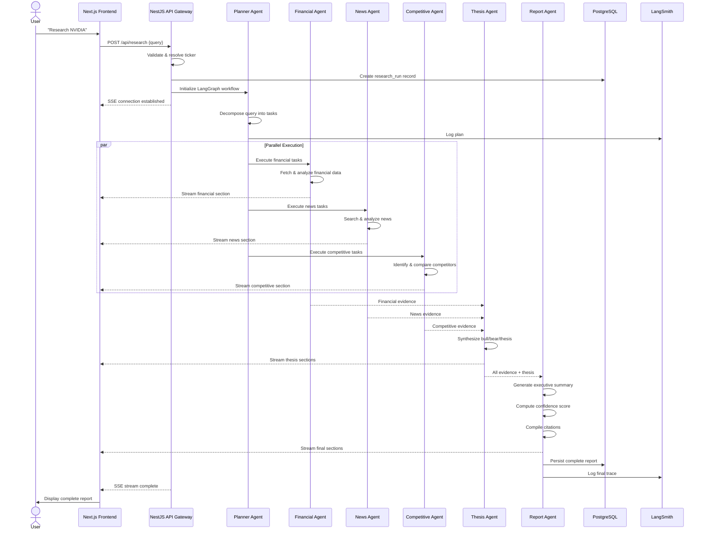
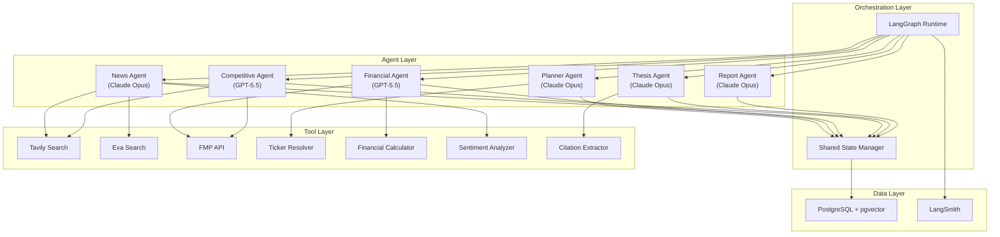
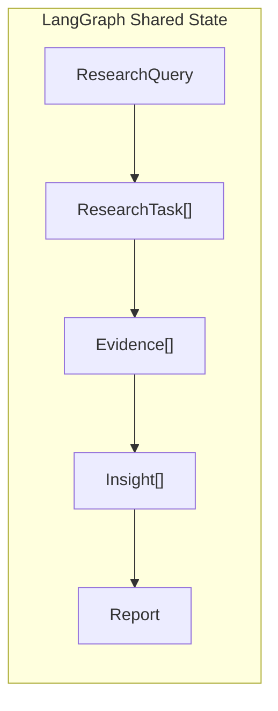
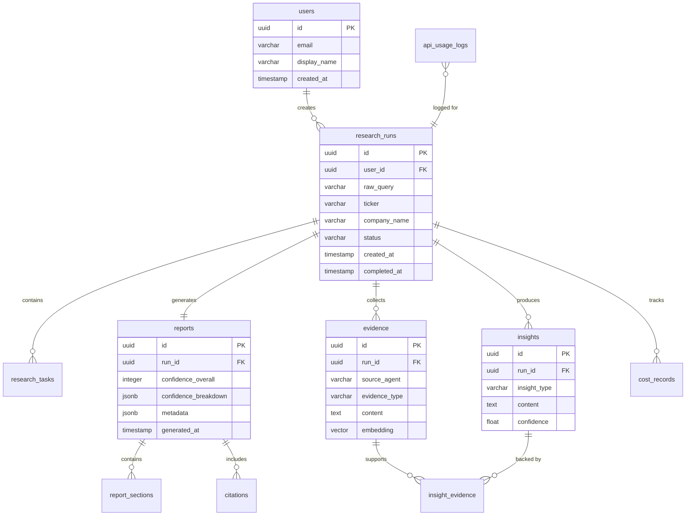
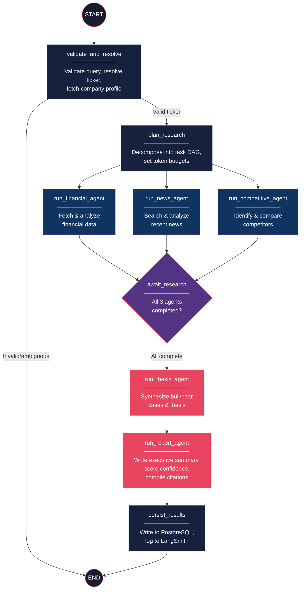
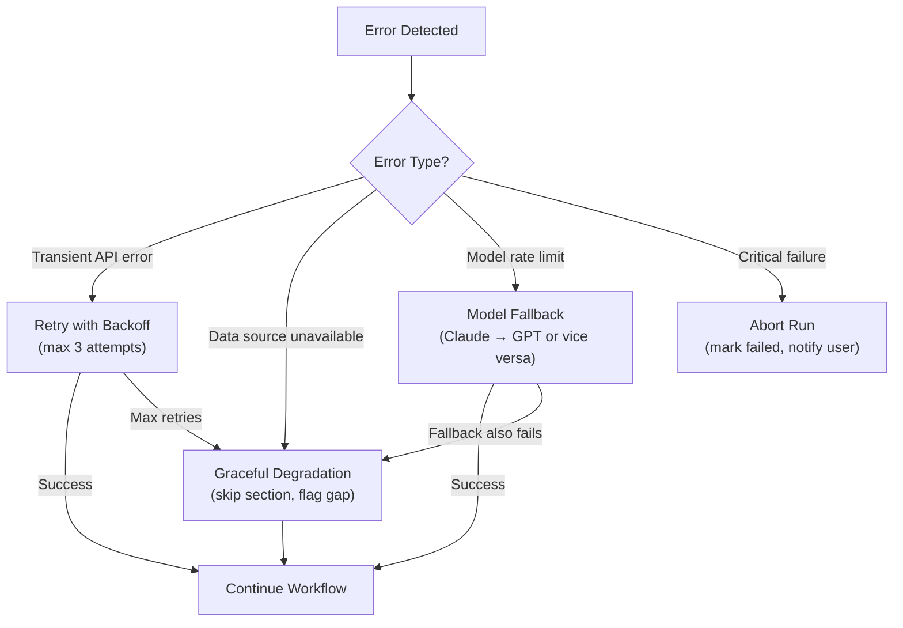
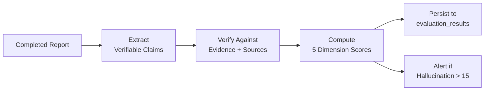

# ResearchGPT — Architecture Specification

> **Version:** 1.0.0-draft  
> **Date:** June 10, 2026  
> **Author:** Staff AI Architect  
> **Status:** Design Review  
> **Classification:** Internal Engineering Document

---

## Table of Contents

1. [Product Vision](#section-1-product-vision)
2. [User Personas](#section-2-user-personas)
3. [Jobs To Be Done](#section-3-jobs-to-be-done)
4. [Functional Requirements](#section-4-functional-requirements)
5. [Non-Functional Requirements](#section-5-non-functional-requirements)
6. [End-to-End Research Workflow](#section-6-end-to-end-research-workflow)
7. [Agent Architecture](#section-7-agent-architecture)
8. [State Management Design](#section-8-state-management-design)
9. [Database Design](#section-9-database-design)
10. [LangGraph Workflow](#section-10-langgraph-workflow)
11. [Evaluation Framework](#section-11-evaluation-framework)
12. [Observability Framework](#section-12-observability-framework)
13. [Cost Tracking Framework](#section-13-cost-tracking-framework)
14. [Security & Guardrails](#section-14-security--guardrails)
15. [V1 Scope](#section-15-v1-scope)
16. [Future Roadmap](#section-16-future-roadmap)

---

## Section 1: Product Vision

### Problem Statement

Retail investors and finance professionals spend 4–8 hours per company performing manual research across earnings reports, news feeds, SEC filings, competitor analysis, and financial data platforms. The output is often fragmented, inconsistent, and biased toward recency or sentiment.

### Vision

**ResearchGPT** is an AI-powered stock research agent that generates Wall-Street-grade equity research reports in under 90 seconds. It ingests live financial data, recent news, competitive intelligence, and market context to produce structured, citation-backed investment reports — democratizing the kind of analysis previously available only to institutional investors.

### Value Proposition

| Dimension | Before ResearchGPT | After ResearchGPT |
|---|---|---|
| **Research Time** | 4–8 hours per company | < 90 seconds |
| **Data Sources** | 2–3 manually checked | 6+ automated, cross-referenced |
| **Output Quality** | Ad-hoc notes, scattered | Structured 10-section report |
| **Citation Coverage** | Rarely cited | Every claim source-linked |
| **Bias Detection** | None | Explicit bull/bear framing |
| **Cost** | $200+ per analyst-hour | < $0.50 per report |

### Design Principles

1. **Evidence-First** — Every insight must link to a verifiable data source. No unsupported claims.
2. **Structured Output** — Reports follow a consistent 10-section format for comparability across companies.
3. **Transparent Confidence** — The system exposes its confidence level and identifies where evidence is thin.
4. **Graceful Degradation** — If a data source fails, the report still generates with explicit gap disclosure.
5. **Cost Awareness** — Every LLM call is budgeted. The system tracks and reports cost per research run.

---

## Section 2: User Personas

### Persona 1: The Retail Investor — "Priya"

| Attribute | Detail |
|---|---|
| **Role** | Self-directed retail investor |
| **Portfolio Size** | $25K–$200K |
| **Technical Skill** | Moderate — uses Robinhood, reads Seeking Alpha |
| **Pain Point** | Cannot justify $200/mo for professional research tools. Spends weekends doing manual DD. |
| **Goal** | Get a "second opinion" on investment theses before committing capital. |
| **Usage Pattern** | 3–5 research queries per week, typically before earnings or on momentum signals. |
| **Success Metric** | Feels informed enough to make a confident buy/hold/sell decision. |

### Persona 2: The Finance Professional — "Marcus"

| Attribute | Detail |
|---|---|
| **Role** | Junior equity analyst at a mid-cap fund |
| **Portfolio Size** | Manages coverage of 15–20 tickers |
| **Technical Skill** | High — uses Bloomberg Terminal, builds DCF models |
| **Pain Point** | Needs rapid screening of unfamiliar companies before deep-diving. |
| **Goal** | Triage 10 companies quickly, shortlist 2–3 for detailed modeling. |
| **Usage Pattern** | Daily, high-frequency during earnings season. |
| **Success Metric** | Saves 60%+ time on initial screening without missing critical signals. |

### Persona 3: The Portfolio Reviewer — "Sarah"

| Attribute | Detail |
|---|---|
| **Role** | Engineering Manager who invests passively in tech stocks |
| **Portfolio Size** | $500K+ (mostly FAANG, semiconductors) |
| **Technical Skill** | Low in finance, high in tech |
| **Pain Point** | Wants periodic "health checks" on her existing holdings without reading quarterly reports. |
| **Goal** | Quarterly review of portfolio positions with actionable thesis validation. |
| **Usage Pattern** | Monthly batch queries on 5–10 holdings. |
| **Success Metric** | Report highlights material changes since last review. |

---

## Section 3: Jobs To Be Done

### Framework: JTBD Syntax

> *When [situation], I want to [motivation], so I can [expected outcome].*

### Primary Jobs

| ID | Job Statement | Priority |
|---|---|---|
| **J-01** | When I hear about a stock on social media, I want to get a rapid, structured analysis, so I can decide if it's worth deeper investigation. | **P0 — Critical** |
| **J-02** | When I'm considering a buy, I want to see both bull and bear cases with evidence, so I can pressure-test my own thesis. | **P0 — Critical** |
| **J-03** | When I need to understand a company's financials, I want the key metrics surfaced and contextualized, so I can assess financial health without reading the 10-K. | **P0 — Critical** |
| **J-04** | When I want to compare a company to competitors, I want a structured competitive analysis, so I can evaluate relative positioning. | **P1 — Important** |
| **J-05** | When I read a research report, I want to verify claims against sources, so I can trust the analysis. | **P0 — Critical** |
| **J-06** | When I review my portfolio, I want to batch-analyze multiple tickers, so I can efficiently triage my holdings. | **P1 — Important** |
| **J-07** | When I read the report, I want to understand how confident the system is, so I can weigh the analysis appropriately. | **P0 — Critical** |

### Consumption Jobs

| ID | Job Statement |
|---|---|
| **JC-01** | I want the report in a clean, readable format that I can share or export. |
| **JC-02** | I want to see the report generate in real-time so I know the system is working. |
| **JC-03** | I want to access my past research reports for comparison. |

---

## Section 4: Functional Requirements

### FR-1: Research Query Processing

| ID | Requirement | Priority |
|---|---|---|
| FR-1.1 | System SHALL accept a natural language research query (e.g., "Research NVIDIA"). | P0 |
| FR-1.2 | System SHALL resolve the query to a valid stock ticker symbol (e.g., NVDA). | P0 |
| FR-1.3 | System SHALL validate that the ticker corresponds to a publicly traded company. | P0 |
| FR-1.4 | System SHALL support queries with additional context (e.g., "Research NVIDIA focusing on AI revenue"). | P1 |
| FR-1.5 | System SHALL reject invalid or ambiguous queries with a helpful error message. | P0 |

### FR-2: Report Generation

| ID | Requirement | Priority |
|---|---|---|
| FR-2.1 | System SHALL generate a 10-section report: Executive Summary, Business Overview, Financial Analysis, Recent News Analysis, Competitive Analysis, Bull Case, Bear Case, Investment Thesis, Confidence Score, Source Citations. | P0 |
| FR-2.2 | System SHALL stream report sections to the client as they are generated. | P0 |
| FR-2.3 | System SHALL complete report generation within 120 seconds under normal conditions. | P0 |
| FR-2.4 | System SHALL include a minimum of 5 unique source citations per report. | P0 |
| FR-2.5 | System SHALL generate a confidence score (0–100) with per-section breakdown. | P0 |

### FR-3: Financial Data

| ID | Requirement | Priority |
|---|---|---|
| FR-3.1 | System SHALL retrieve real-time stock price, market cap, P/E ratio, and 52-week range. | P0 |
| FR-3.2 | System SHALL retrieve the last 4 quarters of income statement, balance sheet, and cash flow data. | P0 |
| FR-3.3 | System SHALL compute derived metrics: revenue growth YoY, gross margin, operating margin, free cash flow yield, debt-to-equity. | P0 |
| FR-3.4 | System SHALL display financial data in tabular format with trend indicators. | P1 |

### FR-4: News & Sentiment

| ID | Requirement | Priority |
|---|---|---|
| FR-4.1 | System SHALL retrieve news articles from the past 30 days relevant to the ticker. | P0 |
| FR-4.2 | System SHALL perform sentiment analysis (positive/negative/neutral) on each article. | P0 |
| FR-4.3 | System SHALL identify and highlight material events (earnings, M&A, lawsuits, regulatory). | P0 |
| FR-4.4 | System SHALL deduplicate and rank news by relevance and recency. | P1 |

### FR-5: Competitive Analysis

| ID | Requirement | Priority |
|---|---|---|
| FR-5.1 | System SHALL identify 3–5 direct competitors based on sector and market positioning. | P0 |
| FR-5.2 | System SHALL compare key financial metrics across the competitive set. | P0 |
| FR-5.3 | System SHALL generate a competitive positioning narrative. | P1 |

### FR-6: User Interface

| ID | Requirement | Priority |
|---|---|---|
| FR-6.1 | System SHALL provide a single-page research interface with query input and report display. | P0 |
| FR-6.2 | System SHALL display a real-time progress indicator showing active research phases. | P0 |
| FR-6.3 | System SHALL support dark mode and responsive layout (desktop + tablet). | P1 |
| FR-6.4 | System SHALL allow exporting the report as PDF. | P2 |

### FR-7: Research History

| ID | Requirement | Priority |
|---|---|---|
| FR-7.1 | System SHALL persist all generated reports with timestamp and query metadata. | P0 |
| FR-7.2 | System SHALL display a history sidebar with searchable past reports. | P1 |
| FR-7.3 | System SHALL allow users to re-run a previous research query. | P2 |

---

## Section 5: Non-Functional Requirements

### NFR-1: Performance

| ID | Requirement | Target | Measurement |
|---|---|---|---|
| NFR-1.1 | Time to first byte (streaming) | < 3 seconds | P95 latency from query submission to first SSE token |
| NFR-1.2 | Total report generation time | < 120 seconds | P95 end-to-end latency |
| NFR-1.3 | Frontend initial load (LCP) | < 2.5 seconds | Lighthouse audit |
| NFR-1.4 | API response latency (non-research) | < 200ms | P99 latency |

### NFR-2: Reliability

| ID | Requirement | Target |
|---|---|---|
| NFR-2.1 | System uptime | 99.5% monthly |
| NFR-2.2 | Report generation success rate | > 95% (partial report counts as success) |
| NFR-2.3 | Graceful degradation | System generates report even if 1–2 data sources fail, with explicit gap disclosure |

### NFR-3: Scalability

| ID | Requirement | Target |
|---|---|---|
| NFR-3.1 | Concurrent research sessions | 10 simultaneous (V1) |
| NFR-3.2 | Database growth | Support 100K reports without performance degradation |
| NFR-3.3 | Horizontal scaling | Stateless backend design supporting multi-instance deployment |

### NFR-4: Security

| ID | Requirement | Target |
|---|---|---|
| NFR-4.1 | API key management | All secrets in environment variables, never in code or client bundles |
| NFR-4.2 | Input sanitization | All user inputs validated and sanitized server-side |
| NFR-4.3 | Rate limiting | Max 10 research queries per user per hour |
| NFR-4.4 | Financial disclaimer | All reports include automated investment disclaimer |

### NFR-5: Observability

| ID | Requirement | Target |
|---|---|---|
| NFR-5.1 | Distributed tracing | Every research run traced end-to-end with LangSmith |
| NFR-5.2 | Cost tracking | Per-run token usage and cost logged and queryable |
| NFR-5.3 | Error alerting | Automated alerts on > 10% failure rate in 5-minute window |

### NFR-6: Cost

| ID | Requirement | Target |
|---|---|---|
| NFR-6.1 | Cost per report | < $0.75 average |
| NFR-6.2 | Monthly infrastructure cost | < $150 for low-traffic deployment |
| NFR-6.3 | LLM fallback | Automatic model downgrade if primary model quota exceeded |

---

## Section 6: End-to-End Research Workflow

### Workflow Diagram



### Phase Descriptions

| Phase | Duration Target | Description |
|---|---|---|
| **1. Query Intake** | < 1s | Validate input, resolve ticker, create run record, open SSE stream. |
| **2. Planning** | < 3s | Planner agent decomposes query into a task DAG with dependencies. |
| **3. Parallel Research** | < 45s | Financial, News, and Competitive agents execute concurrently. Results stream to the client as they complete. |
| **4. Synthesis** | < 20s | Thesis agent ingests all evidence, generates bull case, bear case, and investment thesis. |
| **5. Report Assembly** | < 15s | Report agent writes executive summary, computes confidence score, compiles citations, and delivers the final report. |
| **6. Persistence** | < 2s | Full report, metadata, evidence artifacts, and cost data written to PostgreSQL. |

---

## Section 7: Agent Architecture

### System-Level Architecture



### Model Assignment Strategy

| Agent | Primary Model | Rationale |
|---|---|---|
| **Planner** | Claude Opus | Requires complex reasoning for task decomposition and dependency resolution. |
| **Financial** | GPT-5.5 | Strong numerical reasoning and tabular data interpretation. |
| **News** | Claude Opus | Superior long-context summarization and nuanced sentiment detection. |
| **Competitive** | GPT-5.5 | Effective at structured comparison and data extraction. |
| **Thesis** | Claude Opus | Highest-quality reasoning for synthesizing contradictory evidence into coherent arguments. |
| **Report** | Claude Opus | Best prose quality for the executive summary and narrative flow. |

---

### Agent 1: Planner Agent

**Purpose:** Decomposes the user's research query into a structured execution plan (task DAG) and orchestrates the overall research flow.

#### Inputs

```typescript
interface PlannerInput {
  query: string;               // Raw user query, e.g., "Research NVIDIA"
  ticker: string;              // Resolved ticker symbol, e.g., "NVDA"
  companyName: string;         // Resolved company name, e.g., "NVIDIA Corporation"
  exchange: string;            // Exchange, e.g., "NASDAQ"
  sector: string;              // GICS sector, e.g., "Information Technology"
  industry: string;            // GICS industry, e.g., "Semiconductors"
  focusAreas?: string[];       // Optional user-specified focus areas
  researchRunId: string;       // UUID for this research run
}
```

#### Outputs

```typescript
interface PlannerOutput {
  tasks: ResearchTask[];       // Ordered list of research tasks
  executionPlan: {
    parallelGroups: string[][]; // Task IDs grouped for parallel execution
    dependencies: Record<string, string[]>; // taskId -> depends-on taskIds
  };
  estimatedDuration: number;   // Estimated seconds to completion
  modelBudget: {
    maxInputTokens: number;
    maxOutputTokens: number;
  };
}
```

#### Responsibilities

1. Parse and interpret the user's research intent beyond the ticker symbol.
2. Resolve the ticker to a valid company with sector/industry metadata.
3. Generate a task DAG with appropriate parallelism (Financial, News, Competitive in parallel → Thesis → Report sequential).
4. Assign priority weights to tasks based on query focus areas.
5. Set token budgets per agent to enforce cost constraints.
6. Handle ambiguous queries (e.g., "Research Apple" → clarify AAPL vs. other).

#### Tools

| Tool | Purpose |
|---|---|
| `ticker_resolver` | Maps company names/aliases to ticker symbols via FMP API search endpoint. |
| `company_profile` | Fetches company profile (sector, industry, description) from FMP API. |

#### Failure Modes

| Failure | Detection | Recovery |
|---|---|---|
| Ticker resolution fails | FMP API returns no results | Return error to user: "Could not find a publicly traded company matching your query." |
| Ambiguous ticker | Multiple matches returned | Return top 3 matches to user for disambiguation. |
| FMP API timeout | 10s timeout exceeded | Retry once with exponential backoff. If still failing, use cached company data if available. |
| Invalid query (not a company) | LLM classification confidence < 0.7 | Return error: "Please enter a company name or stock ticker." |

---

### Agent 2: Financial Agent

**Purpose:** Retrieves, computes, and analyzes quantitative financial data to produce the Financial Analysis section.

#### Inputs

```typescript
interface FinancialAgentInput {
  ticker: string;
  companyName: string;
  sector: string;
  industry: string;
  tasks: ResearchTask[];       // Financial-specific tasks from Planner
  tokenBudget: number;
}
```

#### Outputs

```typescript
interface FinancialAgentOutput {
  evidence: Evidence[];
  financialSummary: {
    currentPrice: number;
    marketCap: number;
    peRatio: number | null;
    week52High: number;
    week52Low: number;
    dividendYield: number | null;
  };
  incomeStatementTrend: QuarterlyData[];
  balanceSheetSnapshot: BalanceSheetData;
  cashFlowSummary: CashFlowData;
  derivedMetrics: {
    revenueGrowthYoY: number;
    grossMargin: number;
    operatingMargin: number;
    netMargin: number;
    freeCashFlowYield: number;
    debtToEquity: number;
    currentRatio: number;
    returnOnEquity: number;
  };
  sectionMarkdown: string;     // Rendered Financial Analysis section
  tokenUsage: TokenUsage;
}
```

#### Responsibilities

1. Fetch real-time quote data (price, market cap, P/E, 52-week range).
2. Retrieve 4 most recent quarterly income statements, balance sheets, and cash flow statements.
3. Compute derived financial metrics (margins, growth rates, leverage ratios).
4. Identify notable trends (e.g., declining margins, accelerating revenue, rising debt).
5. Contextualize metrics against sector averages where available.
6. Generate the structured Financial Analysis markdown section with data tables and narrative.
7. Produce `Evidence` objects linking every claim to its data source.

#### Tools

| Tool | Purpose |
|---|---|
| `fmp_quote` | Real-time stock quote from Financial Modeling Prep. |
| `fmp_income_statement` | Quarterly income statement data (last 4 quarters). |
| `fmp_balance_sheet` | Quarterly balance sheet data (last 4 quarters). |
| `fmp_cash_flow` | Quarterly cash flow statement data (last 4 quarters). |
| `fmp_ratios` | Pre-computed financial ratios from FMP. |
| `fmp_sector_pe` | Sector-level P/E benchmarks. |
| `financial_calculator` | Computes derived metrics from raw financial data. |

#### Failure Modes

| Failure | Detection | Recovery |
|---|---|---|
| FMP API rate limit | HTTP 429 response | Exponential backoff (1s, 2s, 4s). Max 3 retries. |
| Missing quarterly data | Fewer than 4 quarters returned | Generate report with available data; note "Limited historical data available" in output. |
| Stale price data | Quote timestamp > 24h old (non-market hours excepted) | Add disclaimer: "Price data may be delayed." |
| FMP API key invalid | HTTP 401/403 | Fail the agent; escalate to Report Agent for gap disclosure. Alert ops. |
| Calculation error (division by zero, NaN) | Runtime exception in calculator | Omit the specific metric; log the error; continue with available metrics. |

---

### Agent 3: News Agent

**Purpose:** Searches for, retrieves, and analyzes recent news to produce the Recent News Analysis section.

#### Inputs

```typescript
interface NewsAgentInput {
  ticker: string;
  companyName: string;
  sector: string;
  tasks: ResearchTask[];
  tokenBudget: number;
}
```

#### Outputs

```typescript
interface NewsAgentOutput {
  evidence: Evidence[];
  articles: AnalyzedArticle[];
  overallSentiment: {
    score: number;            // -1.0 to 1.0
    label: 'very_negative' | 'negative' | 'neutral' | 'positive' | 'very_positive';
    distribution: {
      positive: number;       // Percentage
      neutral: number;
      negative: number;
    };
  };
  materialEvents: MaterialEvent[];
  sectionMarkdown: string;
  tokenUsage: TokenUsage;
}

interface AnalyzedArticle {
  title: string;
  source: string;
  url: string;
  publishedAt: string;        // ISO 8601
  summary: string;            // 2-3 sentence summary
  sentiment: number;          // -1.0 to 1.0
  relevanceScore: number;     // 0.0 to 1.0
  categories: string[];       // e.g., ["earnings", "product_launch"]
}

interface MaterialEvent {
  type: 'earnings' | 'acquisition' | 'divestiture' | 'lawsuit' | 'regulatory' | 'executive_change' | 'product_launch' | 'partnership' | 'other';
  headline: string;
  date: string;
  impact: 'positive' | 'negative' | 'neutral';
  significance: 'high' | 'medium' | 'low';
  sourceUrl: string;
}
```

#### Responsibilities

1. Execute multi-source news search across Tavily and Exa for the company name and ticker.
2. Deduplicate articles from multiple sources (fuzzy title matching + URL normalization).
3. Rank articles by relevance (company-specific > sector-level > market-level).
4. Perform per-article sentiment analysis using the LLM.
5. Identify and classify material events (earnings, M&A, lawsuits, regulatory actions, leadership changes).
6. Compute aggregate sentiment distribution.
7. Generate the Recent News Analysis markdown section.
8. Produce `Evidence` objects with source URLs for all cited articles.

#### Tools

| Tool | Purpose |
|---|---|
| `tavily_search` | Web search optimized for recent news. Query: `"{companyName}" OR "${ticker}" stock news`. |
| `exa_search` | Semantic search for deeper/niche coverage. Configured for `news` content type, last 30 days. |
| `sentiment_analyzer` | LLM-based tool that classifies article sentiment on a -1.0 to 1.0 scale with rationale. |

#### Failure Modes

| Failure | Detection | Recovery |
|---|---|---|
| Tavily API down | HTTP 5xx or timeout (15s) | Fall back to Exa-only results. Note "Limited news sources" in output. |
| Exa API down | HTTP 5xx or timeout (15s) | Fall back to Tavily-only results. |
| Both search APIs down | Both fail | Generate section with disclaimer: "Unable to retrieve recent news. This section is based on cached data or general knowledge." Use LLM's training data as last resort. |
| Zero relevant articles found | No results pass relevance threshold (0.3) | Generate section noting: "No significant news coverage found in the past 30 days." |
| Paywalled content | Article body returns < 100 chars | Use title + snippet only for analysis. Mark source as "limited access." |

---

### Agent 4: Competitive Agent

**Purpose:** Identifies competitors and generates the Competitive Analysis section with structured comparisons.

#### Inputs

```typescript
interface CompetitiveAgentInput {
  ticker: string;
  companyName: string;
  sector: string;
  industry: string;
  financialData: FinancialAgentOutput; // Passed from Financial Agent
  tasks: ResearchTask[];
  tokenBudget: number;
}
```

#### Outputs

```typescript
interface CompetitiveAgentOutput {
  evidence: Evidence[];
  competitors: CompetitorProfile[];
  comparisonTable: ComparisonMetric[];
  competitiveNarrative: string;
  moatAssessment: {
    type: 'wide' | 'narrow' | 'none';
    sources: string[];         // e.g., ["network_effects", "switching_costs"]
    durability: 'high' | 'medium' | 'low';
    rationale: string;
  };
  sectionMarkdown: string;
  tokenUsage: TokenUsage;
}

interface CompetitorProfile {
  ticker: string;
  companyName: string;
  marketCap: number;
  description: string;        // 1-2 sentence positioning
  overlapAreas: string[];     // e.g., ["data center GPUs", "AI training chips"]
}

interface ComparisonMetric {
  metric: string;
  subjectValue: number | string;
  competitors: Record<string, number | string>; // ticker -> value
  unit: string;
  subjectRank: number;        // 1 = best in set
}
```

#### Responsibilities

1. Identify 3–5 direct competitors using LLM reasoning + FMP peer data.
2. Retrieve key financial metrics for each competitor (market cap, revenue, margins, P/E).
3. Build a structured comparison table across standardized metrics.
4. Assess competitive moat (type, sources, durability) using Morningstar-style framework.
5. Generate a competitive positioning narrative.
6. Produce `Evidence` objects linking competitor data to FMP sources.

#### Tools

| Tool | Purpose |
|---|---|
| `fmp_peers` | Retrieves peer companies for a given ticker from FMP. |
| `fmp_quote` | Real-time quotes for competitor tickers. |
| `fmp_ratios` | Financial ratios for competitor comparison. |
| `tavily_search` | Search for competitive dynamics articles (e.g., "NVIDIA vs AMD GPU market share 2026"). |

#### Failure Modes

| Failure | Detection | Recovery |
|---|---|---|
| FMP peers returns empty list | Empty array response | Use LLM to infer competitors from sector/industry. |
| Competitor financial data unavailable | FMP returns 404 for a competitor ticker | Exclude that competitor from comparison table; note in output. |
| Too many competitors identified | > 7 competitors from FMP peers | LLM ranks by relevance; keep top 5. |
| International competitor (limited data) | FMP returns partial data for non-US ticker | Include with available data; note "Limited financial data for international peer." |

---

### Agent 5: Thesis Agent

**Purpose:** Synthesizes all research evidence into bull case, bear case, and investment thesis sections.

#### Inputs

```typescript
interface ThesisAgentInput {
  ticker: string;
  companyName: string;
  financialEvidence: Evidence[];
  newsEvidence: Evidence[];
  competitiveEvidence: Evidence[];
  financialSummary: FinancialAgentOutput['financialSummary'];
  overallSentiment: NewsAgentOutput['overallSentiment'];
  moatAssessment: CompetitiveAgentOutput['moatAssessment'];
  tasks: ResearchTask[];
  tokenBudget: number;
}
```

#### Outputs

```typescript
interface ThesisAgentOutput {
  bullCase: {
    title: string;            // e.g., "AI Infrastructure Dominance"
    keyPoints: ThesisPoint[];  // 3-5 supporting arguments
    catalysts: string[];       // Near-term positive catalysts
    targetScenario: string;    // Qualitative upside scenario
  };
  bearCase: {
    title: string;
    keyPoints: ThesisPoint[];
    risks: string[];           // Key risk factors
    targetScenario: string;    // Qualitative downside scenario
  };
  investmentThesis: {
    recommendation: 'strong_buy' | 'buy' | 'hold' | 'sell' | 'strong_sell';
    summary: string;           // 3-5 sentence thesis statement
    timeHorizon: '3_months' | '6_months' | '1_year' | '2_years';
    keyAssumptions: string[];
    whatToWatch: string[];     // Key metrics/events to monitor
  };
  evidenceGaps: string[];     // Areas where evidence was thin
  sectionMarkdown: string;    // Bull Case + Bear Case + Investment Thesis sections
  tokenUsage: TokenUsage;
}

interface ThesisPoint {
  argument: string;           // The thesis point
  supportingEvidence: string[]; // Evidence IDs backing this point
  confidence: number;         // 0.0 to 1.0 confidence in this point
}
```

#### Responsibilities

1. Review all evidence from Financial, News, and Competitive agents.
2. Identify the 3–5 strongest bullish arguments with supporting evidence chains.
3. Identify the 3–5 strongest bearish arguments with supporting evidence chains.
4. Resolve contradictions between evidence sources explicitly.
5. Synthesize an overall investment thesis with a directional recommendation.
6. Identify evidence gaps — areas where data was insufficient for confident assessment.
7. Assign confidence scores to each thesis point based on evidence quality and quantity.
8. Avoid recency bias by weighting structural factors over transient news.

#### Tools

| Tool | Purpose |
|---|---|
| `citation_extractor` | Links thesis claims back to specific `Evidence` objects from upstream agents. |

#### Failure Modes

| Failure | Detection | Recovery |
|---|---|---|
| Insufficient evidence (< 5 total Evidence objects) | Evidence count check | Generate thesis with heavy caveats. Set overall confidence < 40. Add prominent "Low Confidence" warning. |
| Contradictory evidence with no resolution | LLM unable to reconcile | Present both sides explicitly: "Evidence is mixed on [topic]. Bulls argue X (source), while bears argue Y (source)." |
| All evidence is bullish (no bear case) | Sentiment analysis shows 100% positive | LLM is prompted to steelman bear arguments from general knowledge. Flag as "Speculative bear case — limited evidence-based bearish signals." |
| Token budget exceeded mid-generation | Token count approaches limit | Truncate to key points. Note "Abbreviated analysis due to complexity constraints." |

---

### Agent 6: Report Agent

**Purpose:** Assembles the final research report with executive summary, confidence scoring, and citation compilation.

#### Inputs

```typescript
interface ReportAgentInput {
  ticker: string;
  companyName: string;
  exchange: string;
  financialOutput: FinancialAgentOutput;
  newsOutput: NewsAgentOutput;
  competitiveOutput: CompetitiveAgentOutput;
  thesisOutput: ThesisAgentOutput;
  researchRunId: string;
  totalTokenUsage: TokenUsage;
  totalCost: number;
  wallClockTime: number;      // Total seconds elapsed
}
```

#### Outputs

```typescript
interface ReportAgentOutput {
  report: {
    id: string;               // UUID
    ticker: string;
    companyName: string;
    generatedAt: string;       // ISO 8601
    sections: ReportSection[];
    confidenceScore: ConfidenceScore;
    citations: Citation[];
    metadata: {
      totalTokens: number;
      totalCost: number;
      generationTime: number;
      modelsUsed: string[];
      dataSourcesUsed: string[];
    };
  };
  sectionMarkdown: string;    // Executive Summary + Confidence Score + Citations
  tokenUsage: TokenUsage;
}

interface ConfidenceScore {
  overall: number;            // 0-100
  breakdown: {
    financialDataQuality: number;
    newsCoverage: number;
    competitiveAnalysis: number;
    thesisCoherence: number;
    citationDensity: number;
  };
  rationale: string;          // Explanation of the score
}

interface Citation {
  id: string;                 // [1], [2], etc.
  title: string;
  source: string;             // e.g., "Financial Modeling Prep", "Reuters"
  url: string;
  accessedAt: string;
  type: 'financial_data' | 'news_article' | 'research_report' | 'company_filing' | 'market_data';
}
```

#### Responsibilities

1. Write the Executive Summary — a 200–300 word synthesis of the entire report.
2. Compute the composite confidence score with per-dimension breakdown.
3. Compile and deduplicate all citations from all agents into a numbered reference list.
4. Validate citation URLs are properly formatted and deduplicated.
5. Generate the report metadata (tokens, cost, time, models used).
6. Assemble the final 10-section report in the canonical order.
7. Inject the financial disclaimer.
8. Persist the final report to PostgreSQL.

#### Tools

| Tool | Purpose |
|---|---|
| `citation_extractor` | Deduplicates and formats citations from all agent outputs. |

#### Failure Modes

| Failure | Detection | Recovery |
|---|---|---|
| One or more upstream agents returned no data | Null/empty section output | Generate report with available sections. Add "Data Gap" notice for missing sections. |
| Database write fails | PostgreSQL error on INSERT | Retry once. If still failing, return report to client (it's already streamed) and queue async persistence. Alert ops. |
| Confidence score computation fails | Exception in scoring logic | Default to overall confidence = 50 with note: "Confidence score could not be computed." |
| Total report exceeds context window | Token count > model limit | Summarize intermediate evidence before final synthesis. Use progressive summarization. |

---

## Section 8: State Management Design

### State Architecture

The LangGraph workflow operates on a single shared state object that agents read from and write to. State is checkpointed at each node transition for recoverability.



### Schema Definitions

#### ResearchQuery

```json
{
  "$schema": "http://json-schema.org/draft-07/schema#",
  "title": "ResearchQuery",
  "description": "The initial user request, resolved and enriched by the Planner Agent.",
  "type": "object",
  "required": ["id", "rawQuery", "ticker", "companyName", "status", "createdAt"],
  "properties": {
    "id": {
      "type": "string",
      "format": "uuid",
      "description": "Unique identifier for this research query."
    },
    "rawQuery": {
      "type": "string",
      "description": "The original user input, e.g., 'Research NVIDIA'.",
      "maxLength": 500
    },
    "ticker": {
      "type": "string",
      "description": "Resolved stock ticker symbol, e.g., 'NVDA'.",
      "pattern": "^[A-Z]{1,5}$"
    },
    "companyName": {
      "type": "string",
      "description": "Full legal company name, e.g., 'NVIDIA Corporation'."
    },
    "exchange": {
      "type": "string",
      "description": "Stock exchange, e.g., 'NASDAQ'.",
      "enum": ["NYSE", "NASDAQ", "AMEX", "OTC"]
    },
    "sector": {
      "type": "string",
      "description": "GICS sector classification."
    },
    "industry": {
      "type": "string",
      "description": "GICS industry classification."
    },
    "focusAreas": {
      "type": "array",
      "items": { "type": "string" },
      "description": "Optional user-specified areas of focus, e.g., ['AI revenue', 'data center growth'].",
      "default": []
    },
    "status": {
      "type": "string",
      "enum": ["pending", "planning", "researching", "synthesizing", "reporting", "completed", "failed"],
      "description": "Current lifecycle status of the research query."
    },
    "userId": {
      "type": ["string", "null"],
      "format": "uuid",
      "description": "Optional user identifier for authenticated sessions."
    },
    "createdAt": {
      "type": "string",
      "format": "date-time",
      "description": "ISO 8601 timestamp of query creation."
    },
    "completedAt": {
      "type": ["string", "null"],
      "format": "date-time",
      "description": "ISO 8601 timestamp of query completion."
    },
    "errorMessage": {
      "type": ["string", "null"],
      "description": "Error message if status is 'failed'."
    }
  }
}
```

#### ResearchTask

```json
{
  "$schema": "http://json-schema.org/draft-07/schema#",
  "title": "ResearchTask",
  "description": "A discrete unit of work assigned by the Planner Agent to a specialist agent.",
  "type": "object",
  "required": ["id", "queryId", "agentType", "taskType", "priority", "status"],
  "properties": {
    "id": {
      "type": "string",
      "format": "uuid",
      "description": "Unique task identifier."
    },
    "queryId": {
      "type": "string",
      "format": "uuid",
      "description": "Reference to the parent ResearchQuery."
    },
    "agentType": {
      "type": "string",
      "enum": ["financial", "news", "competitive", "thesis", "report"],
      "description": "The specialist agent responsible for this task."
    },
    "taskType": {
      "type": "string",
      "enum": [
        "fetch_quote",
        "fetch_income_statement",
        "fetch_balance_sheet",
        "fetch_cash_flow",
        "compute_derived_metrics",
        "generate_financial_narrative",
        "search_news",
        "analyze_sentiment",
        "identify_material_events",
        "identify_competitors",
        "fetch_competitor_data",
        "generate_comparison",
        "assess_moat",
        "generate_bull_case",
        "generate_bear_case",
        "generate_investment_thesis",
        "write_executive_summary",
        "compute_confidence_score",
        "compile_citations"
      ],
      "description": "Specific task type within the agent's domain."
    },
    "priority": {
      "type": "integer",
      "minimum": 1,
      "maximum": 10,
      "description": "Execution priority. 1 = highest priority."
    },
    "status": {
      "type": "string",
      "enum": ["pending", "in_progress", "completed", "failed", "skipped"],
      "description": "Current task execution status."
    },
    "dependsOn": {
      "type": "array",
      "items": { "type": "string", "format": "uuid" },
      "description": "Task IDs that must complete before this task can start.",
      "default": []
    },
    "parameters": {
      "type": "object",
      "description": "Task-specific parameters passed to the agent.",
      "additionalProperties": true
    },
    "result": {
      "type": ["object", "null"],
      "description": "Task output data, populated on completion.",
      "additionalProperties": true
    },
    "error": {
      "type": ["string", "null"],
      "description": "Error message if task failed."
    },
    "tokenUsage": {
      "type": ["object", "null"],
      "properties": {
        "inputTokens": { "type": "integer" },
        "outputTokens": { "type": "integer" },
        "model": { "type": "string" }
      },
      "description": "Token usage for this task."
    },
    "startedAt": {
      "type": ["string", "null"],
      "format": "date-time"
    },
    "completedAt": {
      "type": ["string", "null"],
      "format": "date-time"
    },
    "durationMs": {
      "type": ["integer", "null"],
      "description": "Wall clock duration in milliseconds."
    }
  }
}
```

#### Evidence

```json
{
  "$schema": "http://json-schema.org/draft-07/schema#",
  "title": "Evidence",
  "description": "A discrete piece of verified information collected during research. Every claim in the report must link to one or more Evidence objects.",
  "type": "object",
  "required": ["id", "queryId", "sourceAgent", "evidenceType", "content", "sourceUrl", "confidence", "collectedAt"],
  "properties": {
    "id": {
      "type": "string",
      "format": "uuid",
      "description": "Unique evidence identifier."
    },
    "queryId": {
      "type": "string",
      "format": "uuid",
      "description": "Reference to the parent ResearchQuery."
    },
    "sourceAgent": {
      "type": "string",
      "enum": ["financial", "news", "competitive"],
      "description": "Agent that produced this evidence."
    },
    "evidenceType": {
      "type": "string",
      "enum": [
        "financial_metric",
        "financial_trend",
        "news_article",
        "news_sentiment",
        "material_event",
        "competitor_metric",
        "competitive_position",
        "market_data"
      ],
      "description": "Classification of the evidence type."
    },
    "content": {
      "type": "string",
      "description": "Human-readable description of the evidence. e.g., 'NVIDIA Q1 2026 revenue was $44.1B, up 69% YoY.'",
      "maxLength": 2000
    },
    "structuredData": {
      "type": ["object", "null"],
      "description": "Machine-readable structured data associated with this evidence.",
      "additionalProperties": true
    },
    "sourceUrl": {
      "type": "string",
      "format": "uri",
      "description": "URL of the primary source for this evidence."
    },
    "sourceName": {
      "type": "string",
      "description": "Human-readable source name, e.g., 'Financial Modeling Prep', 'Reuters'."
    },
    "confidence": {
      "type": "number",
      "minimum": 0,
      "maximum": 1,
      "description": "Confidence in the accuracy of this evidence. 1.0 = verified from authoritative source."
    },
    "relevanceScore": {
      "type": "number",
      "minimum": 0,
      "maximum": 1,
      "description": "Relevance of this evidence to the research query."
    },
    "collectedAt": {
      "type": "string",
      "format": "date-time",
      "description": "Timestamp when this evidence was collected."
    },
    "dataAsOf": {
      "type": ["string", "null"],
      "format": "date-time",
      "description": "The date the underlying data represents (e.g., quarter end date for financial data)."
    },
    "embedding": {
      "type": ["array", "null"],
      "items": { "type": "number" },
      "description": "Optional pgvector embedding for similarity search. Dimension: 1536."
    }
  }
}
```

#### Insight

```json
{
  "$schema": "http://json-schema.org/draft-07/schema#",
  "title": "Insight",
  "description": "A synthesized analytical conclusion derived from one or more Evidence objects. Insights form the backbone of the thesis and report sections.",
  "type": "object",
  "required": ["id", "queryId", "insightType", "title", "content", "supportingEvidenceIds", "confidence", "generatedBy"],
  "properties": {
    "id": {
      "type": "string",
      "format": "uuid",
      "description": "Unique insight identifier."
    },
    "queryId": {
      "type": "string",
      "format": "uuid",
      "description": "Reference to the parent ResearchQuery."
    },
    "insightType": {
      "type": "string",
      "enum": [
        "bull_point",
        "bear_point",
        "financial_strength",
        "financial_weakness",
        "competitive_advantage",
        "competitive_risk",
        "catalyst",
        "headwind",
        "valuation_signal",
        "sentiment_signal"
      ],
      "description": "Classification of the insight."
    },
    "title": {
      "type": "string",
      "description": "Short, descriptive title. e.g., 'Data Center Revenue Accelerating'.",
      "maxLength": 200
    },
    "content": {
      "type": "string",
      "description": "Detailed narrative of the insight with reasoning.",
      "maxLength": 3000
    },
    "supportingEvidenceIds": {
      "type": "array",
      "items": { "type": "string", "format": "uuid" },
      "minItems": 1,
      "description": "Evidence IDs that support this insight. Must reference at least one Evidence object."
    },
    "contradictingEvidenceIds": {
      "type": "array",
      "items": { "type": "string", "format": "uuid" },
      "description": "Evidence IDs that contradict or qualify this insight.",
      "default": []
    },
    "confidence": {
      "type": "number",
      "minimum": 0,
      "maximum": 1,
      "description": "Confidence in this insight based on evidence quality and quantity."
    },
    "impact": {
      "type": "string",
      "enum": ["high", "medium", "low"],
      "description": "Estimated impact on investment decision."
    },
    "timeHorizon": {
      "type": "string",
      "enum": ["near_term", "medium_term", "long_term"],
      "description": "Time horizon over which this insight is relevant."
    },
    "generatedBy": {
      "type": "string",
      "enum": ["thesis", "financial", "news", "competitive"],
      "description": "Agent that generated this insight."
    },
    "createdAt": {
      "type": "string",
      "format": "date-time"
    }
  }
}
```

#### Report

```json
{
  "$schema": "http://json-schema.org/draft-07/schema#",
  "title": "Report",
  "description": "The final assembled research report, containing all 10 sections, metadata, and quality scores.",
  "type": "object",
  "required": ["id", "queryId", "ticker", "companyName", "sections", "confidenceScore", "citations", "metadata", "generatedAt"],
  "properties": {
    "id": {
      "type": "string",
      "format": "uuid",
      "description": "Unique report identifier."
    },
    "queryId": {
      "type": "string",
      "format": "uuid",
      "description": "Reference to the parent ResearchQuery."
    },
    "ticker": {
      "type": "string",
      "pattern": "^[A-Z]{1,5}$"
    },
    "companyName": {
      "type": "string"
    },
    "exchange": {
      "type": "string"
    },
    "sections": {
      "type": "array",
      "items": {
        "type": "object",
        "required": ["sectionId", "title", "order", "content"],
        "properties": {
          "sectionId": {
            "type": "string",
            "enum": [
              "executive_summary",
              "business_overview",
              "financial_analysis",
              "news_analysis",
              "competitive_analysis",
              "bull_case",
              "bear_case",
              "investment_thesis",
              "confidence_score",
              "citations"
            ]
          },
          "title": { "type": "string" },
          "order": { "type": "integer", "minimum": 1, "maximum": 10 },
          "content": {
            "type": "string",
            "description": "Rendered markdown content for this section."
          },
          "generatedBy": {
            "type": "string",
            "enum": ["planner", "financial", "news", "competitive", "thesis", "report"]
          },
          "tokenUsage": {
            "type": "object",
            "properties": {
              "inputTokens": { "type": "integer" },
              "outputTokens": { "type": "integer" }
            }
          },
          "hasDataGap": {
            "type": "boolean",
            "description": "True if this section was generated with incomplete data.",
            "default": false
          }
        }
      },
      "minItems": 10,
      "maxItems": 10,
      "description": "Exactly 10 report sections in canonical order."
    },
    "confidenceScore": {
      "type": "object",
      "required": ["overall", "breakdown", "rationale"],
      "properties": {
        "overall": { "type": "integer", "minimum": 0, "maximum": 100 },
        "breakdown": {
          "type": "object",
          "properties": {
            "financialDataQuality": { "type": "integer", "minimum": 0, "maximum": 100 },
            "newsCoverage": { "type": "integer", "minimum": 0, "maximum": 100 },
            "competitiveAnalysis": { "type": "integer", "minimum": 0, "maximum": 100 },
            "thesisCoherence": { "type": "integer", "minimum": 0, "maximum": 100 },
            "citationDensity": { "type": "integer", "minimum": 0, "maximum": 100 }
          }
        },
        "rationale": { "type": "string" }
      }
    },
    "citations": {
      "type": "array",
      "items": {
        "type": "object",
        "required": ["id", "title", "source", "url", "type", "accessedAt"],
        "properties": {
          "id": { "type": "string", "description": "Display ID, e.g., '[1]'" },
          "title": { "type": "string" },
          "source": { "type": "string" },
          "url": { "type": "string", "format": "uri" },
          "type": {
            "type": "string",
            "enum": ["financial_data", "news_article", "research_report", "company_filing", "market_data"]
          },
          "accessedAt": { "type": "string", "format": "date-time" }
        }
      },
      "minItems": 5,
      "description": "Minimum 5 unique citations."
    },
    "metadata": {
      "type": "object",
      "required": ["totalInputTokens", "totalOutputTokens", "totalCost", "generationTimeSeconds", "modelsUsed"],
      "properties": {
        "totalInputTokens": { "type": "integer" },
        "totalOutputTokens": { "type": "integer" },
        "totalCost": { "type": "number", "description": "Total cost in USD." },
        "generationTimeSeconds": { "type": "number" },
        "modelsUsed": {
          "type": "array",
          "items": { "type": "string" }
        },
        "dataSourcesUsed": {
          "type": "array",
          "items": { "type": "string" }
        },
        "agentExecutionLog": {
          "type": "array",
          "items": {
            "type": "object",
            "properties": {
              "agent": { "type": "string" },
              "startedAt": { "type": "string", "format": "date-time" },
              "completedAt": { "type": "string", "format": "date-time" },
              "status": { "type": "string", "enum": ["completed", "partial", "failed"] },
              "tokensUsed": { "type": "integer" }
            }
          }
        }
      }
    },
    "disclaimer": {
      "type": "string",
      "description": "Legal/financial disclaimer appended to every report.",
      "default": "This report is generated by an AI system and is for informational purposes only. It does not constitute financial advice, a recommendation, or an offer to buy or sell any security. Always consult with a qualified financial advisor before making investment decisions. Past performance is not indicative of future results."
    },
    "generatedAt": {
      "type": "string",
      "format": "date-time"
    },
    "version": {
      "type": "string",
      "description": "Report schema version.",
      "default": "1.0.0"
    }
  }
}
```

---

## Section 9: Database Design

### Entity Relationship Diagram



### Table Definitions

```sql
-- ============================================================
-- ResearchGPT Database Schema
-- PostgreSQL 16+ with pgvector extension
-- ============================================================

-- Enable required extensions
CREATE EXTENSION IF NOT EXISTS "uuid-ossp";
CREATE EXTENSION IF NOT EXISTS "pgvector";

-- ============================================================
-- USERS
-- ============================================================
CREATE TABLE users (
    id              UUID PRIMARY KEY DEFAULT uuid_generate_v4(),
    email           VARCHAR(255) UNIQUE,
    display_name    VARCHAR(100),
    avatar_url      VARCHAR(500),
    auth_provider   VARCHAR(50),          -- 'google', 'github', 'email'
    auth_provider_id VARCHAR(255),
    is_active       BOOLEAN DEFAULT true,
    tier            VARCHAR(20) DEFAULT 'free'
                    CHECK (tier IN ('free', 'pro', 'enterprise')),
    monthly_query_count INTEGER DEFAULT 0,
    monthly_query_limit INTEGER DEFAULT 20,
    created_at      TIMESTAMP WITH TIME ZONE DEFAULT NOW(),
    updated_at      TIMESTAMP WITH TIME ZONE DEFAULT NOW()
);

CREATE INDEX idx_users_email ON users(email);
CREATE INDEX idx_users_auth ON users(auth_provider, auth_provider_id);

-- ============================================================
-- RESEARCH RUNS
-- The central entity for each research execution
-- ============================================================
CREATE TABLE research_runs (
    id              UUID PRIMARY KEY DEFAULT uuid_generate_v4(),
    user_id         UUID REFERENCES users(id) ON DELETE SET NULL,
    raw_query       VARCHAR(500) NOT NULL,
    ticker          VARCHAR(10) NOT NULL,
    company_name    VARCHAR(255) NOT NULL,
    exchange        VARCHAR(20),
    sector          VARCHAR(100),
    industry        VARCHAR(100),
    focus_areas     TEXT[],               -- Array of focus area strings
    status          VARCHAR(20) NOT NULL DEFAULT 'pending'
                    CHECK (status IN (
                        'pending', 'planning', 'researching',
                        'synthesizing', 'reporting', 'completed', 'failed'
                    )),
    error_message   TEXT,
    langsmith_trace_id VARCHAR(255),       -- LangSmith trace reference
    total_duration_ms INTEGER,
    created_at      TIMESTAMP WITH TIME ZONE DEFAULT NOW(),
    completed_at    TIMESTAMP WITH TIME ZONE
);

CREATE INDEX idx_runs_user ON research_runs(user_id);
CREATE INDEX idx_runs_ticker ON research_runs(ticker);
CREATE INDEX idx_runs_status ON research_runs(status);
CREATE INDEX idx_runs_created ON research_runs(created_at DESC);
CREATE INDEX idx_runs_user_created ON research_runs(user_id, created_at DESC);

-- ============================================================
-- RESEARCH TASKS
-- Individual tasks assigned by the Planner Agent
-- ============================================================
CREATE TABLE research_tasks (
    id              UUID PRIMARY KEY DEFAULT uuid_generate_v4(),
    run_id          UUID NOT NULL REFERENCES research_runs(id) ON DELETE CASCADE,
    agent_type      VARCHAR(20) NOT NULL
                    CHECK (agent_type IN (
                        'planner', 'financial', 'news',
                        'competitive', 'thesis', 'report'
                    )),
    task_type       VARCHAR(50) NOT NULL,
    priority        INTEGER NOT NULL CHECK (priority BETWEEN 1 AND 10),
    status          VARCHAR(20) NOT NULL DEFAULT 'pending'
                    CHECK (status IN (
                        'pending', 'in_progress', 'completed',
                        'failed', 'skipped'
                    )),
    depends_on      UUID[],               -- Array of task IDs this depends on
    parameters      JSONB DEFAULT '{}',
    result          JSONB,
    error_message   TEXT,
    input_tokens    INTEGER,
    output_tokens   INTEGER,
    model_used      VARCHAR(50),
    started_at      TIMESTAMP WITH TIME ZONE,
    completed_at    TIMESTAMP WITH TIME ZONE,
    duration_ms     INTEGER
);

CREATE INDEX idx_tasks_run ON research_tasks(run_id);
CREATE INDEX idx_tasks_status ON research_tasks(run_id, status);
CREATE INDEX idx_tasks_agent ON research_tasks(agent_type);

-- ============================================================
-- EVIDENCE
-- Raw data collected by research agents
-- ============================================================
CREATE TABLE evidence (
    id              UUID PRIMARY KEY DEFAULT uuid_generate_v4(),
    run_id          UUID NOT NULL REFERENCES research_runs(id) ON DELETE CASCADE,
    source_agent    VARCHAR(20) NOT NULL
                    CHECK (source_agent IN ('financial', 'news', 'competitive')),
    evidence_type   VARCHAR(30) NOT NULL
                    CHECK (evidence_type IN (
                        'financial_metric', 'financial_trend',
                        'news_article', 'news_sentiment', 'material_event',
                        'competitor_metric', 'competitive_position', 'market_data'
                    )),
    content         TEXT NOT NULL,
    structured_data JSONB,
    source_url      VARCHAR(2000) NOT NULL,
    source_name     VARCHAR(255),
    confidence      NUMERIC(3,2) NOT NULL CHECK (confidence BETWEEN 0 AND 1),
    relevance_score NUMERIC(3,2) CHECK (relevance_score BETWEEN 0 AND 1),
    data_as_of      TIMESTAMP WITH TIME ZONE,
    embedding       vector(1536),         -- pgvector for semantic search
    collected_at    TIMESTAMP WITH TIME ZONE DEFAULT NOW()
);

CREATE INDEX idx_evidence_run ON evidence(run_id);
CREATE INDEX idx_evidence_agent ON evidence(source_agent);
CREATE INDEX idx_evidence_type ON evidence(evidence_type);
CREATE INDEX idx_evidence_embedding ON evidence
    USING ivfflat (embedding vector_cosine_ops)
    WITH (lists = 100);

-- ============================================================
-- INSIGHTS
-- Synthesized conclusions from evidence
-- ============================================================
CREATE TABLE insights (
    id                      UUID PRIMARY KEY DEFAULT uuid_generate_v4(),
    run_id                  UUID NOT NULL REFERENCES research_runs(id) ON DELETE CASCADE,
    insight_type            VARCHAR(30) NOT NULL
                            CHECK (insight_type IN (
                                'bull_point', 'bear_point',
                                'financial_strength', 'financial_weakness',
                                'competitive_advantage', 'competitive_risk',
                                'catalyst', 'headwind',
                                'valuation_signal', 'sentiment_signal'
                            )),
    title                   VARCHAR(200) NOT NULL,
    content                 TEXT NOT NULL,
    confidence              NUMERIC(3,2) NOT NULL CHECK (confidence BETWEEN 0 AND 1),
    impact                  VARCHAR(10) CHECK (impact IN ('high', 'medium', 'low')),
    time_horizon            VARCHAR(15) CHECK (time_horizon IN ('near_term', 'medium_term', 'long_term')),
    generated_by            VARCHAR(20) NOT NULL,
    created_at              TIMESTAMP WITH TIME ZONE DEFAULT NOW()
);

CREATE INDEX idx_insights_run ON insights(run_id);
CREATE INDEX idx_insights_type ON insights(insight_type);

-- ============================================================
-- INSIGHT <-> EVIDENCE JUNCTION TABLE
-- ============================================================
CREATE TABLE insight_evidence (
    insight_id      UUID NOT NULL REFERENCES insights(id) ON DELETE CASCADE,
    evidence_id     UUID NOT NULL REFERENCES evidence(id) ON DELETE CASCADE,
    relationship    VARCHAR(20) NOT NULL DEFAULT 'supports'
                    CHECK (relationship IN ('supports', 'contradicts')),
    PRIMARY KEY (insight_id, evidence_id)
);

CREATE INDEX idx_ie_evidence ON insight_evidence(evidence_id);

-- ============================================================
-- REPORTS
-- Final assembled research reports
-- ============================================================
CREATE TABLE reports (
    id                      UUID PRIMARY KEY DEFAULT uuid_generate_v4(),
    run_id                  UUID NOT NULL UNIQUE REFERENCES research_runs(id) ON DELETE CASCADE,
    ticker                  VARCHAR(10) NOT NULL,
    company_name            VARCHAR(255) NOT NULL,
    exchange                VARCHAR(20),
    confidence_overall      INTEGER NOT NULL CHECK (confidence_overall BETWEEN 0 AND 100),
    confidence_breakdown    JSONB NOT NULL,
    recommendation          VARCHAR(20)
                            CHECK (recommendation IN (
                                'strong_buy', 'buy', 'hold', 'sell', 'strong_sell'
                            )),
    total_input_tokens      INTEGER NOT NULL,
    total_output_tokens     INTEGER NOT NULL,
    total_cost_usd          NUMERIC(8,4) NOT NULL,
    generation_time_seconds NUMERIC(8,2) NOT NULL,
    models_used             TEXT[] NOT NULL,
    data_sources_used       TEXT[] NOT NULL,
    disclaimer              TEXT NOT NULL,
    report_version          VARCHAR(20) DEFAULT '1.0.0',
    generated_at            TIMESTAMP WITH TIME ZONE DEFAULT NOW()
);

CREATE INDEX idx_reports_run ON reports(run_id);
CREATE INDEX idx_reports_ticker ON reports(ticker);
CREATE INDEX idx_reports_generated ON reports(generated_at DESC);

-- ============================================================
-- REPORT SECTIONS
-- Individual sections of the report
-- ============================================================
CREATE TABLE report_sections (
    id              UUID PRIMARY KEY DEFAULT uuid_generate_v4(),
    report_id       UUID NOT NULL REFERENCES reports(id) ON DELETE CASCADE,
    section_id      VARCHAR(30) NOT NULL
                    CHECK (section_id IN (
                        'executive_summary', 'business_overview',
                        'financial_analysis', 'news_analysis',
                        'competitive_analysis', 'bull_case', 'bear_case',
                        'investment_thesis', 'confidence_score', 'citations'
                    )),
    title           VARCHAR(100) NOT NULL,
    section_order   INTEGER NOT NULL CHECK (section_order BETWEEN 1 AND 10),
    content         TEXT NOT NULL,
    generated_by    VARCHAR(20) NOT NULL,
    has_data_gap    BOOLEAN DEFAULT false,
    input_tokens    INTEGER,
    output_tokens   INTEGER,
    UNIQUE (report_id, section_id)
);

CREATE INDEX idx_sections_report ON report_sections(report_id);

-- ============================================================
-- CITATIONS
-- Source references for report claims
-- ============================================================
CREATE TABLE citations (
    id              UUID PRIMARY KEY DEFAULT uuid_generate_v4(),
    report_id       UUID NOT NULL REFERENCES reports(id) ON DELETE CASCADE,
    display_id      VARCHAR(10) NOT NULL,  -- e.g., '[1]', '[2]'
    title           VARCHAR(500) NOT NULL,
    source_name     VARCHAR(255) NOT NULL,
    url             VARCHAR(2000) NOT NULL,
    citation_type   VARCHAR(20) NOT NULL
                    CHECK (citation_type IN (
                        'financial_data', 'news_article',
                        'research_report', 'company_filing', 'market_data'
                    )),
    accessed_at     TIMESTAMP WITH TIME ZONE DEFAULT NOW(),
    UNIQUE (report_id, display_id)
);

CREATE INDEX idx_citations_report ON citations(report_id);

-- ============================================================
-- COST RECORDS
-- Per-agent cost tracking
-- ============================================================
CREATE TABLE cost_records (
    id              UUID PRIMARY KEY DEFAULT uuid_generate_v4(),
    run_id          UUID NOT NULL REFERENCES research_runs(id) ON DELETE CASCADE,
    agent_type      VARCHAR(20) NOT NULL,
    model           VARCHAR(50) NOT NULL,
    input_tokens    INTEGER NOT NULL,
    output_tokens   INTEGER NOT NULL,
    input_cost_usd  NUMERIC(8,6) NOT NULL,
    output_cost_usd NUMERIC(8,6) NOT NULL,
    total_cost_usd  NUMERIC(8,4) NOT NULL,
    api_call_type   VARCHAR(50),          -- 'llm', 'tavily', 'exa', 'fmp'
    recorded_at     TIMESTAMP WITH TIME ZONE DEFAULT NOW()
);

CREATE INDEX idx_costs_run ON cost_records(run_id);
CREATE INDEX idx_costs_agent ON cost_records(agent_type);
CREATE INDEX idx_costs_recorded ON cost_records(recorded_at DESC);

-- ============================================================
-- API USAGE LOGS
-- External API call tracking
-- ============================================================
CREATE TABLE api_usage_logs (
    id              UUID PRIMARY KEY DEFAULT uuid_generate_v4(),
    run_id          UUID REFERENCES research_runs(id) ON DELETE SET NULL,
    api_provider    VARCHAR(50) NOT NULL,  -- 'fmp', 'tavily', 'exa', 'openai', 'anthropic'
    endpoint        VARCHAR(255) NOT NULL,
    http_method     VARCHAR(10) DEFAULT 'GET',
    status_code     INTEGER,
    response_time_ms INTEGER,
    request_size_bytes INTEGER,
    response_size_bytes INTEGER,
    error_message   TEXT,
    called_at       TIMESTAMP WITH TIME ZONE DEFAULT NOW()
);

CREATE INDEX idx_api_logs_run ON api_usage_logs(run_id);
CREATE INDEX idx_api_logs_provider ON api_usage_logs(api_provider);
CREATE INDEX idx_api_logs_called ON api_usage_logs(called_at DESC);

-- ============================================================
-- USEFUL VIEWS
-- ============================================================

-- Aggregated cost per research run
CREATE VIEW v_run_costs AS
SELECT
    run_id,
    COUNT(*) AS total_cost_records,
    SUM(input_tokens) AS total_input_tokens,
    SUM(output_tokens) AS total_output_tokens,
    SUM(total_cost_usd) AS total_cost_usd,
    ROUND(AVG(total_cost_usd), 4) AS avg_cost_per_agent,
    array_agg(DISTINCT model) AS models_used
FROM cost_records
GROUP BY run_id;

-- Daily cost summary
CREATE VIEW v_daily_costs AS
SELECT
    DATE(recorded_at) AS date,
    COUNT(DISTINCT run_id) AS total_runs,
    SUM(total_cost_usd) AS total_cost_usd,
    ROUND(AVG(total_cost_usd), 4) AS avg_cost_per_record,
    SUM(input_tokens) AS total_input_tokens,
    SUM(output_tokens) AS total_output_tokens
FROM cost_records
GROUP BY DATE(recorded_at)
ORDER BY date DESC;

-- Research run summary with report metrics
CREATE VIEW v_research_summary AS
SELECT
    rr.id AS run_id,
    rr.ticker,
    rr.company_name,
    rr.status,
    rr.total_duration_ms,
    r.confidence_overall,
    r.recommendation,
    r.total_cost_usd,
    r.total_input_tokens + r.total_output_tokens AS total_tokens,
    r.generation_time_seconds,
    (SELECT COUNT(*) FROM citations c WHERE c.report_id = r.id) AS citation_count,
    (SELECT COUNT(*) FROM evidence e WHERE e.run_id = rr.id) AS evidence_count,
    rr.created_at
FROM research_runs rr
LEFT JOIN reports r ON r.run_id = rr.id
ORDER BY rr.created_at DESC;
```

---

## Section 10: LangGraph Workflow

### Workflow Graph



### Node-by-Node Execution Flow

#### Node 1: `validate_and_resolve`

| Property | Value |
|---|---|
| **Trigger** | Research query received from API gateway |
| **LLM** | None (API calls only) |
| **Timeout** | 10 seconds |

**Operations:**
1. Sanitize input query (trim, lowercase, remove special characters).
2. Call `fmp_search` to resolve query to ticker candidates.
3. If single match: proceed with resolved ticker + company profile.
4. If multiple matches: return disambiguation prompt to user (exits graph).
5. If zero matches: return error (exits graph).
6. Fetch full company profile from FMP (sector, industry, description, exchange).
7. Write `ResearchQuery` to shared state.
8. Update `research_runs` table status → `planning`.
9. Emit SSE event: `{ type: 'status', phase: 'validating', message: 'Resolved NVDA - NVIDIA Corporation' }`.

**State Mutations:**
```typescript
state.query = resolvedResearchQuery;
state.status = 'planning';
```

**Routing:**
- ✅ Valid single ticker → `plan_research`
- ❌ Ambiguous → END (return disambiguation options)
- ❌ Invalid → END (return error)

---

#### Node 2: `plan_research`

| Property | Value |
|---|---|
| **Trigger** | `validate_and_resolve` success |
| **LLM** | Claude Opus |
| **Max Tokens** | 2,000 output |
| **Timeout** | 15 seconds |

**Operations:**
1. Construct planning prompt with company profile, sector context, and any focus areas.
2. LLM generates structured task list with dependencies and priorities.
3. Parse LLM output into `ResearchTask[]` objects.
4. Compute parallel execution groups from dependency DAG.
5. Assign per-agent token budgets (total budget: ~50K input, ~10K output).
6. Write all tasks to shared state and database.
7. Emit SSE event: `{ type: 'status', phase: 'planning', message: 'Research plan created: 12 tasks across 5 agents' }`.

**State Mutations:**
```typescript
state.tasks = generatedTasks;
state.executionPlan = { parallelGroups, dependencies };
state.status = 'researching';
```

**Routing:** → `run_financial_agent` + `run_news_agent` + `run_competitive_agent` (parallel fan-out)

---

#### Node 3: `run_financial_agent`

| Property | Value |
|---|---|
| **Trigger** | `plan_research` complete (parallel) |
| **LLM** | GPT-5.5 |
| **Max Tokens** | 15,000 input / 3,000 output |
| **Timeout** | 45 seconds |

**Operations:**
1. Execute financial tasks in sequence:
   - `fetch_quote` → Real-time price data.
   - `fetch_income_statement` → Last 4 quarters.
   - `fetch_balance_sheet` → Last 4 quarters.
   - `fetch_cash_flow` → Last 4 quarters.
   - `compute_derived_metrics` → Margins, growth, leverage.
2. Pass all raw data to GPT-5.5 for narrative generation.
3. LLM generates Financial Analysis section markdown with data tables.
4. Create `Evidence` objects for each data point.
5. Stream section content via SSE: `{ type: 'section', section: 'financial_analysis', content: '...' }`.
6. Record cost data.

**State Mutations:**
```typescript
state.financialOutput = financialAgentOutput;
state.evidence.push(...financialEvidence);
state.completedAgents.push('financial');
```

**Routing:** → `await_research` (gate)

---

#### Node 4: `run_news_agent`

| Property | Value |
|---|---|
| **Trigger** | `plan_research` complete (parallel) |
| **LLM** | Claude Opus |
| **Max Tokens** | 20,000 input / 3,000 output |
| **Timeout** | 45 seconds |

**Operations:**
1. Execute Tavily search: `"{companyName}" OR "${ticker}" stock news recent`.
2. Execute Exa search with semantic query: `Latest news and developments for {companyName} stock`.
3. Merge and deduplicate results (fuzzy title match, threshold 0.85).
4. Rank by relevance score (company-specific mentions weighted 2x).
5. Select top 10–15 articles for analysis.
6. LLM performs batch sentiment analysis on selected articles.
7. LLM identifies material events from article set.
8. Compute aggregate sentiment distribution.
9. Generate News Analysis section markdown.
10. Create `Evidence` objects for each cited article.
11. Stream section content via SSE.

**State Mutations:**
```typescript
state.newsOutput = newsAgentOutput;
state.evidence.push(...newsEvidence);
state.completedAgents.push('news');
```

**Routing:** → `await_research` (gate)

---

#### Node 5: `run_competitive_agent`

| Property | Value |
|---|---|
| **Trigger** | `plan_research` complete (parallel) |
| **LLM** | GPT-5.5 |
| **Max Tokens** | 15,000 input / 3,000 output |
| **Timeout** | 45 seconds |

**Operations:**
1. Fetch peer companies from FMP peers endpoint.
2. If FMP returns empty, use LLM to infer 3–5 competitors from sector/industry.
3. Fetch quote + financial ratios for each competitor (up to 5).
4. Build comparison table: market cap, revenue, P/E, gross margin, revenue growth.
5. LLM assesses competitive moat (type, durability, sources).
6. LLM generates competitive positioning narrative.
7. Generate Competitive Analysis section markdown with comparison table.
8. Create `Evidence` objects for competitor data.
9. Stream section content via SSE.

**State Mutations:**
```typescript
state.competitiveOutput = competitiveAgentOutput;
state.evidence.push(...competitiveEvidence);
state.completedAgents.push('competitive');
```

**Routing:** → `await_research` (gate)

---

#### Node 6: `await_research` (Conditional Gate)

| Property | Value |
|---|---|
| **Type** | Conditional edge / fan-in barrier |
| **Timeout** | 90 seconds (total for all parallel agents) |

**Logic:**
```typescript
function shouldContinue(state: ResearchState): string {
  const required = ['financial', 'news', 'competitive'];
  const completed = state.completedAgents;
  const allDone = required.every(a => completed.includes(a));

  if (allDone) return 'run_thesis_agent';

  // Check for timeout or all-failed scenario
  const elapsed = Date.now() - state.researchStartTime;
  if (elapsed > 90_000) {
    // Timeout: proceed with whatever we have
    state.hasPartialData = true;
    return 'run_thesis_agent';
  }

  return '__wait__'; // LangGraph continues waiting for remaining nodes
}
```

**State Mutations:**
```typescript
state.status = 'synthesizing';
```

**Routing:**
- All 3 complete → `run_thesis_agent`
- Timeout with partial results → `run_thesis_agent` (with gap flags)

---

#### Node 7: `run_thesis_agent`

| Property | Value |
|---|---|
| **Trigger** | All research agents complete OR timeout |
| **LLM** | Claude Opus |
| **Max Tokens** | 25,000 input / 5,000 output |
| **Timeout** | 30 seconds |

**Operations:**
1. Collect all `Evidence` objects from shared state.
2. Construct synthesis prompt with:
   - Financial summary and derived metrics.
   - News sentiment and material events.
   - Competitive positioning and moat assessment.
   - Any evidence gaps flagged by upstream agents.
3. LLM generates bull case (3–5 points with evidence chains).
4. LLM generates bear case (3–5 points with evidence chains).
5. LLM synthesizes investment thesis with recommendation.
6. Create `Insight` objects linking back to `Evidence`.
7. Tag each insight with confidence, impact, and time horizon.
8. Generate Bull Case, Bear Case, and Investment Thesis section markdowns.
9. Stream sections via SSE (3 separate section events).

**State Mutations:**
```typescript
state.thesisOutput = thesisAgentOutput;
state.insights.push(...generatedInsights);
state.status = 'reporting';
```

**Routing:** → `run_report_agent`

---

#### Node 8: `run_report_agent`

| Property | Value |
|---|---|
| **Trigger** | `run_thesis_agent` complete |
| **LLM** | Claude Opus |
| **Max Tokens** | 30,000 input / 3,000 output |
| **Timeout** | 25 seconds |

**Operations:**
1. Read all section outputs from state.
2. Compile deduplicated citation list from all `Evidence` objects.
3. Assign citation display IDs: `[1]`, `[2]`, etc.
4. Cross-reference report text with citations, inserting inline references.
5. Compute confidence score:
   - `financialDataQuality`: Based on data completeness (4/4 quarters = 100).
   - `newsCoverage`: Based on article count and source diversity.
   - `competitiveAnalysis`: Based on competitor count and data completeness.
   - `thesisCoherence`: LLM self-assessment of argument quality.
   - `citationDensity`: Citations per 500 words of report.
   - `overall`: Weighted average (financial 25%, news 20%, competitive 15%, thesis 25%, citations 15%).
6. Generate Executive Summary (200–300 words synthesizing the full report).
7. Generate Business Overview from company profile + research context.
8. Render Confidence Score section with breakdown visualization.
9. Render Citations section with numbered references.
10. Assemble final 10-section report object.
11. Append financial disclaimer.
12. Stream remaining sections via SSE.

**State Mutations:**
```typescript
state.report = finalReport;
state.status = 'persisting';
```

**Routing:** → `persist_results`

---

#### Node 9: `persist_results`

| Property | Value |
|---|---|
| **Trigger** | `run_report_agent` complete |
| **LLM** | None |
| **Timeout** | 10 seconds |

**Operations:**
1. Begin database transaction.
2. INSERT into `reports` table.
3. INSERT into `report_sections` (10 rows).
4. INSERT into `citations`.
5. INSERT into `evidence` (with embeddings if computed).
6. INSERT into `insights` and `insight_evidence` junction.
7. INSERT into `cost_records` (one per agent).
8. UPDATE `research_runs` → status = `completed`, set `completed_at`.
9. Commit transaction.
10. Flush LangSmith trace.
11. Emit SSE event: `{ type: 'complete', reportId: '...' }`.
12. Close SSE stream.

**State Mutations:**
```typescript
state.status = 'completed';
state.reportId = report.id;
```

**Routing:** → END

---

### Error Handling Strategy



---

## Section 11: Evaluation Framework

### Overview

The evaluation framework quantifies report quality across five dimensions. Scores are computed automatically after each research run and persisted for longitudinal quality monitoring.

### Metric Definitions

#### 1. Coverage Score (0–100)

**Definition:** Measures the completeness of the research report — whether all 10 sections contain substantive content and all expected data points are present.

| Component | Weight | Measurement |
|---|---|---|
| Section completeness | 40% | All 10 sections present and non-empty (10 pts each) |
| Financial data coverage | 20% | Presence of: price, market cap, P/E, revenue, margins, growth, debt metrics (1/7 each) |
| News coverage | 15% | At least 5 relevant articles analyzed |
| Competitor coverage | 10% | At least 3 competitors with comparison data |
| Thesis coverage | 15% | Bull case (3+ points) + Bear case (3+ points) + Recommendation |

```typescript
function computeCoverageScore(report: Report): number {
  const sectionScore = report.sections.filter(s => s.content.length > 100).length * 4; // max 40
  const financialFields = ['currentPrice', 'marketCap', 'peRatio', 'revenueGrowthYoY', 'grossMargin', 'operatingMargin', 'debtToEquity'];
  const financialScore = (presentFields / 7) * 20; // max 20
  const newsScore = Math.min(articleCount / 5, 1) * 15; // max 15
  const competitorScore = Math.min(competitorCount / 3, 1) * 10; // max 10
  const thesisScore = (hasBullCase * 5 + hasBearCase * 5 + hasRecommendation * 5); // max 15
  return sectionScore + financialScore + newsScore + competitorScore + thesisScore;
}
```

#### 2. Accuracy Score (0–100)

**Definition:** Measures the factual correctness of financial data and claims against authoritative sources.

| Component | Weight | Measurement |
|---|---|---|
| Financial data verification | 50% | Cross-check reported metrics against a second FMP API call |
| Numerical consistency | 25% | Derived metrics match raw data (e.g., margin % = income / revenue) |
| Date accuracy | 15% | Reported dates (quarter ends, news dates) match source data |
| Company identity accuracy | 10% | Company name, ticker, exchange, sector are correct |

**Implementation:**
- Post-generation verification pass compares reported financial figures against a fresh FMP API call.
- Tolerance: ±1% for prices (market movement), exact match for ratios and historical data.
- Logged per-field: `{ field: 'revenueQ1', reported: 44.1B, verified: 44.1B, match: true }`.

#### 3. Citation Score (0–100)

**Definition:** Measures the quality and density of source citations throughout the report.

| Component | Weight | Measurement |
|---|---|---|
| Citation count | 25% | Minimum 5 citations (100 at 5+, linear below) |
| Citation diversity | 25% | At least 3 distinct source types (financial_data, news_article, etc.) |
| Citation density | 25% | At least 1 citation per 500 words of report body |
| Citation validity | 25% | All citation URLs are well-formed and non-duplicate |

```typescript
function computeCitationScore(report: Report): number {
  const countScore = Math.min(citations.length / 5, 1) * 25;
  const typeSet = new Set(citations.map(c => c.type));
  const diversityScore = Math.min(typeSet.size / 3, 1) * 25;
  const wordCount = sections.reduce((sum, s) => sum + s.content.split(' ').length, 0);
  const densityTarget = Math.ceil(wordCount / 500);
  const densityScore = Math.min(citations.length / densityTarget, 1) * 25;
  const validUrls = citations.filter(c => isValidUrl(c.url)).length;
  const validityScore = (validUrls / citations.length) * 25;
  return countScore + diversityScore + densityScore + validityScore;
}
```

#### 4. Confidence Score (0–100)

**Definition:** The system's self-assessed confidence in the overall report quality, computed by the Report Agent.

> [!NOTE]
> This is the same confidence score exposed in Section 9 of the report. It is listed here for completeness as an evaluation metric.

| Component | Weight | Measurement |
|---|---|---|
| Financial data quality | 25% | Data completeness and recency |
| News coverage depth | 20% | Article volume, diversity, and relevance |
| Competitive analysis depth | 15% | Competitor count and comparison completeness |
| Thesis coherence | 25% | LLM self-evaluation of argument quality |
| Citation density | 15% | Citations per section |

#### 5. Hallucination Score (0–100, lower is better)

**Definition:** Measures the extent to which the report contains claims that cannot be traced to provided evidence. Target: < 10.

| Component | Weight | Detection Method |
|---|---|---|
| Unsupported financial claims | 40% | Post-generation pass: extract all numerical claims, verify each links to an Evidence object or FMP data |
| Unsupported news claims | 30% | Post-generation pass: extract all event/news references, verify each links to a citation |
| Fabricated competitors | 15% | Verify all mentioned competitor tickers exist in FMP |
| Fabricated sources | 15% | Verify all citation URLs are from known, queried sources (not hallucinated URLs) |

**Implementation:**
```typescript
function computeHallucinationScore(report: Report, evidence: Evidence[], citations: Citation[]): number {
  const claims = extractVerifiableClaims(report); // LLM-based claim extraction
  let unsupportedCount = 0;
  for (const claim of claims) {
    const hasEvidence = evidence.some(e => claimMatchesEvidence(claim, e));
    const hasCitation = citations.some(c => claimMatchesCitation(claim, c));
    if (!hasEvidence && !hasCitation) unsupportedCount++;
  }
  return Math.round((unsupportedCount / claims.length) * 100);
}
```

### Evaluation Pipeline



### Evaluation Results Table

```sql
CREATE TABLE evaluation_results (
    id                  UUID PRIMARY KEY DEFAULT uuid_generate_v4(),
    report_id           UUID NOT NULL REFERENCES reports(id) ON DELETE CASCADE,
    coverage_score      INTEGER NOT NULL CHECK (coverage_score BETWEEN 0 AND 100),
    accuracy_score      INTEGER NOT NULL CHECK (accuracy_score BETWEEN 0 AND 100),
    citation_score      INTEGER NOT NULL CHECK (citation_score BETWEEN 0 AND 100),
    confidence_score    INTEGER NOT NULL CHECK (confidence_score BETWEEN 0 AND 100),
    hallucination_score INTEGER NOT NULL CHECK (hallucination_score BETWEEN 0 AND 100),
    composite_score     INTEGER NOT NULL CHECK (composite_score BETWEEN 0 AND 100),
    claim_count         INTEGER,
    unsupported_claims  INTEGER,
    details             JSONB,             -- Per-claim verification results
    evaluated_at        TIMESTAMP WITH TIME ZONE DEFAULT NOW()
);

CREATE INDEX idx_eval_report ON evaluation_results(report_id);
CREATE INDEX idx_eval_composite ON evaluation_results(composite_score);
```

### Quality Gates

| Metric | Warning Threshold | Critical Threshold | Action |
|---|---|---|---|
| Coverage Score | < 70 | < 50 | Log warning / Alert + flag report |
| Accuracy Score | < 85 | < 70 | Log warning / Block report delivery |
| Citation Score | < 60 | < 40 | Log warning / Alert |
| Hallucination Score | > 15 | > 25 | Alert / Block report + manual review |
| Composite Score | < 65 | < 50 | Alert / Full report audit |

---

## Section 12: Observability Framework

### Observability Stack

| Layer | Tool | Purpose |
|---|---|---|
| **Tracing** | LangSmith | End-to-end agent trace, LLM call inspection, prompt debugging |
| **Metrics** | Application-level counters + PostgreSQL views | Business and system metrics |
| **Logging** | Structured JSON logging (NestJS Logger) | Request/response logging, error tracking |
| **Agent Monitoring** | LangSmith + custom dashboard | Agent performance, success rates, latency |

### Metrics

#### Business Metrics

| Metric | Type | Description | Collection |
|---|---|---|---|
| `research.runs.total` | Counter | Total research runs initiated | Incremented on run creation |
| `research.runs.completed` | Counter | Successfully completed research runs | Incremented on run completion |
| `research.runs.failed` | Counter | Failed research runs | Incremented on run failure |
| `research.runs.duration_seconds` | Histogram | End-to-end research run duration | Recorded on completion |
| `research.reports.confidence_score` | Histogram | Distribution of confidence scores | Recorded on report generation |
| `research.reports.citation_count` | Histogram | Citations per report | Recorded on report generation |
| `research.cost.per_run_usd` | Histogram | Cost per research run in USD | Recorded on completion |
| `research.users.daily_active` | Gauge | Unique users per day | Aggregated daily |

#### System Metrics

| Metric | Type | Description | Collection |
|---|---|---|---|
| `agent.{name}.duration_ms` | Histogram | Per-agent execution time | Per-agent timing |
| `agent.{name}.success_rate` | Gauge | Per-agent success rate (rolling 1h) | Computed from task status |
| `agent.{name}.token_usage` | Counter | Per-agent token consumption | From LLM responses |
| `api.{provider}.latency_ms` | Histogram | External API call latency | Per-call timing |
| `api.{provider}.error_rate` | Gauge | External API error rate (rolling 5m) | From HTTP status codes |
| `api.{provider}.rate_limit_hits` | Counter | Rate limit (429) responses | From HTTP status codes |
| `db.query.duration_ms` | Histogram | Database query latency | Query instrumentation |
| `sse.connections.active` | Gauge | Active SSE streaming connections | Connection tracking |

### Logging

#### Log Format

All logs use structured JSON format:

```json
{
  "timestamp": "2026-06-10T14:30:00.000Z",
  "level": "info",
  "service": "researchgpt-api",
  "traceId": "abc123-def456",
  "runId": "550e8400-e29b-41d4-a716-446655440000",
  "agent": "financial",
  "message": "Financial data retrieval completed",
  "duration_ms": 3420,
  "metadata": {
    "ticker": "NVDA",
    "quartersRetrieved": 4,
    "metricsComputed": 8
  }
}
```

#### Log Levels

| Level | Usage | Example |
|---|---|---|
| `ERROR` | Unrecoverable failures, data loss risks | FMP API key invalid, database connection lost |
| `WARN` | Recoverable issues, degraded functionality | Missing quarterly data, fallback to secondary model |
| `INFO` | Normal operational events | Research run started, agent completed, report generated |
| `DEBUG` | Detailed diagnostic information | LLM prompt/response pairs, raw API responses |

#### Sensitive Data Policy

- ❌ Never log full LLM prompts in production (use LangSmith for prompt inspection).
- ❌ Never log API keys or auth tokens.
- ✅ Log request IDs, run IDs, and agent names.
- ✅ Log token counts and cost data.
- ✅ Log error messages and stack traces.

### Tracing

#### LangSmith Integration

Every research run creates a single LangSmith trace with the following hierarchy:

```
Research Run (root span)
├── validate_and_resolve
│   ├── fmp_search API call
│   └── fmp_profile API call
├── plan_research
│   └── Claude Opus LLM call (planning)
├── run_financial_agent
│   ├── fmp_quote API call
│   ├── fmp_income_statement API call
│   ├── fmp_balance_sheet API call
│   ├── fmp_cash_flow API call
│   ├── financial_calculator tool call
│   └── GPT-5.5 LLM call (narrative)
├── run_news_agent
│   ├── tavily_search API call
│   ├── exa_search API call
│   └── Claude Opus LLM call (sentiment + narrative)
├── run_competitive_agent
│   ├── fmp_peers API call
│   ├── fmp_quote API calls (per competitor)
│   └── GPT-5.5 LLM call (comparison + moat)
├── run_thesis_agent
│   └── Claude Opus LLM call (synthesis)
├── run_report_agent
│   └── Claude Opus LLM call (executive summary + scoring)
└── persist_results
    └── PostgreSQL transaction
```

#### Trace Metadata

Each trace is tagged with:
```typescript
{
  "run_id": "uuid",
  "ticker": "NVDA",
  "company": "NVIDIA Corporation",
  "user_id": "uuid",
  "total_cost_usd": 0.42,
  "total_tokens": 45000,
  "duration_seconds": 67,
  "confidence_score": 82,
  "status": "completed"
}
```

### Agent Monitoring Dashboard

#### Key Panels

| Panel | Visualization | Data Source |
|---|---|---|
| **Research Runs Over Time** | Time-series line chart | `research_runs` table |
| **Success/Failure Rate** | Stacked area chart | `research_runs.status` |
| **Avg Generation Time** | Line chart with P50/P95 bands | `research_runs.total_duration_ms` |
| **Per-Agent Latency** | Grouped bar chart | `research_tasks.duration_ms` |
| **Per-Agent Success Rate** | Donut chart per agent | `research_tasks.status` |
| **Cost Per Run Trend** | Line chart | `cost_records` aggregated |
| **Token Usage by Model** | Stacked bar chart | `cost_records.model` |
| **Confidence Score Distribution** | Histogram | `reports.confidence_overall` |
| **External API Health** | Status grid (green/yellow/red) | `api_usage_logs.status_code` |
| **Active SSE Connections** | Real-time gauge | Application metrics |

---

## Section 13: Cost Tracking Framework

### LLM Pricing Model (as of June 2026)

| Model | Input Cost (per 1M tokens) | Output Cost (per 1M tokens) |
|---|---|---|
| Claude Opus | $15.00 | $75.00 |
| GPT-5.5 | $2.00 | $10.00 |

> [!IMPORTANT]
> These prices are estimates. Verify against current API pricing before production launch. Implement a pricing config that can be updated without redeployment.

### Estimated Token Budget Per Research Run

| Agent | Model | Est. Input Tokens | Est. Output Tokens | Est. Cost |
|---|---|---|---|---|
| **Planner** | Claude Opus | 1,500 | 800 | $0.082 |
| **Financial** | GPT-5.5 | 12,000 | 2,500 | $0.049 |
| **News** | Claude Opus | 18,000 | 2,500 | $0.458 |
| **Competitive** | GPT-5.5 | 10,000 | 2,000 | $0.040 |
| **Thesis** | Claude Opus | 20,000 | 4,000 | $0.600 |
| **Report** | Claude Opus | 25,000 | 2,500 | $0.563 |
| **TOTAL** | — | **~86,500** | **~14,300** | **~$1.79** |

### External API Costs

| API | Pricing Model | Est. Calls/Run | Est. Cost/Run |
|---|---|---|---|
| Financial Modeling Prep | $29/mo (250 calls/day) | 8–12 calls | ~$0.03 (amortized) |
| Tavily | $0.01/search (pay-as-you-go) | 2–3 searches | ~$0.03 |
| Exa | $0.01/search (pay-as-you-go) | 1–2 searches | ~$0.02 |

### Total Estimated Cost Per Report

| Component | Est. Cost |
|---|---|
| LLM tokens | $1.79 |
| External APIs | $0.08 |
| **Total per report** | **~$1.87** |

> [!WARNING]
> The estimated cost ($1.87) exceeds the NFR target of < $0.75. **Optimization strategies** (see below) should bring this to target.

### Cost Optimization Strategies

| Strategy | Est. Savings | Implementation Complexity |
|---|---|---|
| **Prompt caching** (Claude Opus cache hits) | 40–60% on repeated context | Low — enable via API flag |
| **Aggressive context pruning** | 20–30% token reduction | Medium — summarize before passing to downstream agents |
| **Model downgrade for non-critical agents** | 50%+ on Financial/Competitive | Low — use GPT-5.5-mini or Claude Haiku for data-heavy tasks |
| **Evidence caching** (reuse financial data within 24h) | 15–20% API + token savings | Medium — cache layer with TTL |
| **Streaming summarization** | 15–25% on Thesis/Report input tokens | Medium — progressive summarization pipeline |

### Cost Tracking Implementation

```typescript
interface CostTracker {
  // Called after every LLM call
  recordLLMUsage(params: {
    runId: string;
    agent: AgentType;
    model: string;
    inputTokens: number;
    outputTokens: number;
  }): Promise<void>;

  // Called after every external API call
  recordAPIUsage(params: {
    runId: string;
    provider: 'fmp' | 'tavily' | 'exa';
    endpoint: string;
    cost: number;
  }): Promise<void>;

  // Computed on run completion
  getRunCost(runId: string): Promise<{
    llmCost: number;
    apiCost: number;
    totalCost: number;
    breakdown: Record<AgentType, number>;
  }>;

  // Budget enforcement
  checkBudget(runId: string): Promise<{
    withinBudget: boolean;
    spent: number;
    remaining: number;
    budgetLimit: number;
  }>;
}
```

### Budget Enforcement

| Guardrail | Threshold | Action |
|---|---|---|
| Per-run hard limit | $5.00 | Abort run, return partial results |
| Per-run soft limit | $3.00 | Log warning, continue with reduced token budgets |
| Per-agent limit | $1.50 | Force agent to summarize and conclude |
| Daily user limit | $10.00 (free tier) | Reject new queries with "Daily limit reached" |
| Monthly system limit | $500.00 | Alert ops, switch to lower-cost models |

---

## Section 14: Security & Guardrails

### API Key Management

| Key | Storage | Rotation Policy |
|---|---|---|
| OpenAI API Key | Environment variable (`OPENAI_API_KEY`) | Every 90 days |
| Anthropic API Key | Environment variable (`ANTHROPIC_API_KEY`) | Every 90 days |
| FMP API Key | Environment variable (`FMP_API_KEY`) | On plan renewal |
| Tavily API Key | Environment variable (`TAVILY_API_KEY`) | Every 90 days |
| Exa API Key | Environment variable (`EXA_API_KEY`) | Every 90 days |
| Database URL | Environment variable (`DATABASE_URL`) | Password rotated every 90 days |
| LangSmith API Key | Environment variable (`LANGSMITH_API_KEY`) | Every 90 days |

> [!CAUTION]
> **Never** commit API keys to version control. Use `.env.local` for development and a secrets manager (e.g., AWS Secrets Manager, Vercel Environment Variables) for production.

### Input Validation & Sanitization

```typescript
// Query validation pipeline
function validateResearchQuery(input: string): ValidationResult {
  // 1. Length check
  if (input.length > 500) return { valid: false, error: 'Query too long (max 500 chars)' };
  if (input.length < 2) return { valid: false, error: 'Query too short' };

  // 2. Character sanitization — strip potential injection characters
  const sanitized = input
    .replace(/[<>{}]/g, '')     // Remove HTML/template injection chars
    .replace(/[\x00-\x1F]/g, '') // Remove control characters
    .trim();

  // 3. Prompt injection detection
  const injectionPatterns = [
    /ignore\s+(previous|above|all)\s+(instructions|prompts)/i,
    /system\s*prompt/i,
    /you\s+are\s+now/i,
    /forget\s+(everything|all)/i,
    /\bDAN\b/i,
    /do\s+anything\s+now/i,
  ];
  for (const pattern of injectionPatterns) {
    if (pattern.test(sanitized)) {
      return { valid: false, error: 'Invalid query format' };
    }
  }

  // 4. Content classification — must be a company/stock query
  // (Final classification delegated to Planner Agent LLM)
  return { valid: true, sanitized };
}
```

### Rate Limiting

| Scope | Limit | Window | Response |
|---|---|---|---|
| Per IP (unauthenticated) | 5 queries | 1 hour | HTTP 429 + `Retry-After` header |
| Per user (free tier) | 10 queries | 1 hour | HTTP 429 + upgrade prompt |
| Per user (pro tier) | 50 queries | 1 hour | HTTP 429 |
| Global (system-wide) | 100 concurrent runs | — | HTTP 503 + queue position |

### LLM Output Guardrails

| Guardrail | Implementation |
|---|---|
| **Financial disclaimer** | Appended to every report automatically (not LLM-generated). Hardcoded in Report Agent. |
| **No specific price targets** | System prompt instructs: "Do NOT provide specific price targets or numerical buy/sell recommendations." Post-generation regex check for `$[0-9]+ price target`. |
| **No personalized advice** | System prompt instructs: "Do NOT address the reader directly with personalized investment advice." |
| **Uncertainty disclosure** | When confidence < 60, prepend: "⚠️ Low Confidence Report — Limited data was available for this analysis." |
| **Data freshness disclosure** | Report header includes: "Data as of: {date}. Financial data may be delayed up to 24 hours." |
| **Competitor fairness** | System prompt instructs: "Present competitor analysis objectively. Do not disparage competitors." |

### Content Safety

| Risk | Mitigation |
|---|---|
| Generating content about non-public companies | Ticker validation against FMP database |
| Generating content about sanctioned entities | No mitigation in V1 (low risk for US-listed equities) |
| User uploads malicious content | No file upload in V1 — text-only queries |
| XSS via report content | Sanitize all LLM output before rendering in frontend (DOMPurify) |
| SQL injection | Parameterized queries only (TypeORM/Prisma) |

### Data Privacy

| Data Type | Retention | Access |
|---|---|---|
| User queries | 90 days | User + admin |
| Generated reports | Indefinite (user-facing feature) | User + admin |
| LLM prompts/responses | 30 days (via LangSmith) | Admin only |
| API call logs | 30 days | Admin only |
| Cost records | Indefinite | Admin only |

---

## Section 15: V1 Scope

### In Scope (MVP)

| Feature | Priority | Status |
|---|---|---|
| Single-ticker research query | P0 | ✅ In Scope |
| 10-section structured report | P0 | ✅ In Scope |
| Real-time SSE streaming | P0 | ✅ In Scope |
| Financial data from FMP | P0 | ✅ In Scope |
| News search via Tavily + Exa | P0 | ✅ In Scope |
| Competitive analysis (3–5 peers) | P0 | ✅ In Scope |
| Bull/Bear case generation | P0 | ✅ In Scope |
| Confidence scoring | P0 | ✅ In Scope |
| Source citations (5+ per report) | P0 | ✅ In Scope |
| Research history (list + view) | P1 | ✅ In Scope |
| Dark mode UI | P1 | ✅ In Scope |
| Cost tracking per run | P1 | ✅ In Scope |
| LangSmith tracing | P1 | ✅ In Scope |
| Financial disclaimer | P0 | ✅ In Scope |
| Rate limiting (IP-based) | P0 | ✅ In Scope |

### Out of Scope (V1)

| Feature | Reason | Target Version |
|---|---|---|
| User authentication | Complexity; V1 works as anonymous/session-based | V2 |
| Multi-ticker comparison | Requires significant UX + agent orchestration changes | V2 |
| PDF export | Nice-to-have, not core value | V2 |
| Watchlists & alerts | Requires persistent user accounts | V2 |
| Real-time price streaming | Requires WebSocket infrastructure + data licensing | V3 |
| SEC filing analysis (10-K, 10-Q) | Requires PDF parsing + large context handling | V2 |
| Custom report templates | Low priority for initial validation | V3 |
| Mobile-optimized UI | Desktop-first for portfolio demo | V2 |
| Batch research (multiple tickers) | Complexity + cost management | V2 |
| Natural language follow-up questions | Conversational UI adds significant complexity | V3 |

### V1 Architecture Constraints

| Constraint | Rationale |
|---|---|
| Single-instance deployment | V1 targets portfolio demo, not production scale |
| No horizontal auto-scaling | Cost optimization for low-traffic |
| Session-based identity (no auth) | Reduced scope; session UUID stored in localStorage |
| Single region deployment | Simplicity; US region covers primary data sources |
| No CDN for report content | Reports are dynamic; caching adds complexity |

### V1 Success Criteria

| Metric | Target |
|---|---|
| Report generation success rate | > 90% |
| Average generation time | < 90 seconds |
| Average confidence score | > 65 |
| Average hallucination score | < 15 |
| Average citation count | ≥ 5 per report |
| Cost per report | < $2.50 (pre-optimization) |
| User can complete a research flow | End-to-end in < 2 minutes |

---

## Section 16: Future Roadmap

### V2 — Enhanced Research (Target: Q4 2026)

| Feature | Description |
|---|---|
| **User Authentication** | Google/GitHub OAuth via NextAuth.js. Enable persistent history, watchlists, and usage tracking. |
| **SEC Filing Analysis** | Integrate SEC EDGAR API. Parse 10-K, 10-Q, 8-K filings. Extract risk factors, management discussion, and financial tables. |
| **Multi-Ticker Comparison** | "Compare NVDA vs AMD vs INTC" → Side-by-side report with relative valuation. |
| **PDF Export** | Generate downloadable PDF reports with charts and tables. |
| **Batch Research** | Queue multiple tickers for sequential research. Progress dashboard for batch jobs. |
| **Semantic Search on Past Reports** | Use pgvector embeddings to search across all past reports: "Which of my researched companies has the highest free cash flow yield?" |
| **Mobile-Responsive UI** | Full responsive design for tablet and mobile viewports. |

### V3 — Intelligence Platform (Target: Q2 2027)

| Feature | Description |
|---|---|
| **Conversational Follow-ups** | After a report generates, users can ask follow-up questions: "What's NVIDIA's biggest risk from China tariffs?" |
| **Watchlist & Alerts** | Monitor tickers for material events. Push notifications when significant news or price movements occur. |
| **Custom Report Templates** | Users define which sections to include, depth level, and focus areas. |
| **Technical Analysis Agent** | New agent for chart pattern recognition, support/resistance levels, and momentum indicators. |
| **Earnings Calendar Integration** | Proactive reports before earnings dates for watchlisted companies. |
| **Report Versioning & Diffing** | Compare reports for the same ticker over time. Highlight what changed. |
| **Collaboration Features** | Share reports with team members. Annotation and commenting. |

### V4 — Enterprise (Target: Q4 2027)

| Feature | Description |
|---|---|
| **Multi-Tenancy** | Isolated workspaces for teams with admin controls. |
| **Custom Data Sources** | Integrate proprietary data feeds, internal research, and alternative data (satellite, social media). |
| **Model Fine-Tuning** | Fine-tune models on high-quality equity research reports for improved output quality. |
| **Compliance & Audit** | Full audit trail for regulated environments. Export compliance reports. |
| **API Access** | RESTful API for programmatic research queries. Webhook callbacks on completion. |
| **White-Label** | Customizable branding for financial advisory firms. |

### Technical Debt Roadmap

| Item | Priority | Description |
|---|---|---|
| Prompt engineering iteration | High | Systematic A/B testing of prompts for each agent |
| Evidence caching layer | High | Cache FMP data with 24h TTL to reduce API calls and cost |
| Model cost optimization | High | Test cheaper models (Claude Haiku, GPT-5.5-mini) for data-heavy agents |
| End-to-end integration tests | Medium | Automated test suite with mocked API responses |
| Load testing | Medium | Simulate 50 concurrent users, identify bottlenecks |
| Prompt injection hardening | Medium | Red-team testing and adversarial prompt evaluation |
| Database query optimization | Low | Add composite indexes based on actual query patterns |
| Monitoring dashboard | Low | Build custom Grafana/internal dashboard from PostgreSQL metrics views |

---

## Appendix A: Technology Stack Summary

| Layer | Technology | Version | Purpose |
|---|---|---|---|
| **Frontend** | Next.js | 15.x | React framework with SSR, routing, API routes |
| **UI Components** | shadcn/ui | Latest | Accessible, composable component library |
| **Styling** | Tailwind CSS | 4.x | Utility-first CSS framework |
| **Backend** | NestJS | 11.x | TypeScript backend framework with DI, modules, guards |
| **Language** | TypeScript | 5.x | Type-safe development across frontend and backend |
| **Agent Framework** | LangGraph | Latest | Stateful, multi-agent orchestration with checkpointing |
| **LLM (Primary)** | Claude Opus | Latest | Complex reasoning, synthesis, narrative generation |
| **LLM (Secondary)** | GPT-5.5 | Latest | Numerical reasoning, data extraction, comparison |
| **Database** | PostgreSQL | 16.x | Primary data store |
| **Vector Store** | pgvector | 0.7.x | Embedding storage and similarity search |
| **Web Search** | Tavily | Latest | Real-time news and web search |
| **Semantic Search** | Exa | Latest | Neural/semantic search for deeper coverage |
| **Financial Data** | Financial Modeling Prep | Latest | Stock quotes, financial statements, company data |
| **Observability** | LangSmith | Latest | LLM tracing, prompt debugging, evaluation |
| **Streaming** | Server-Sent Events (SSE) | — | Real-time report streaming to client |
| **ORM** | Prisma | 6.x | Type-safe database access |
| **Deployment** | Vercel (FE) + Railway/Fly.io (BE) | — | Cloud hosting |

---

## Appendix B: Glossary

| Term | Definition |
|---|---|
| **Evidence** | A discrete, source-linked data point collected during research |
| **Insight** | A synthesized conclusion derived from one or more Evidence objects |
| **Research Run** | A single end-to-end execution of the research pipeline for one ticker |
| **Task DAG** | Directed Acyclic Graph of research tasks with dependency ordering |
| **Moat** | Competitive advantage that protects a company from competitors (Morningstar framework) |
| **SSE** | Server-Sent Events — HTTP-based streaming protocol for real-time updates |
| **GICS** | Global Industry Classification Standard — sector/industry taxonomy |
| **pgvector** | PostgreSQL extension for vector similarity search |
| **Fan-out/Fan-in** | Pattern where work is distributed to parallel workers and results are aggregated |

---

*End of Architecture Specification*

*Document Version: 1.0.0-draft | Last Updated: June 10, 2026*
